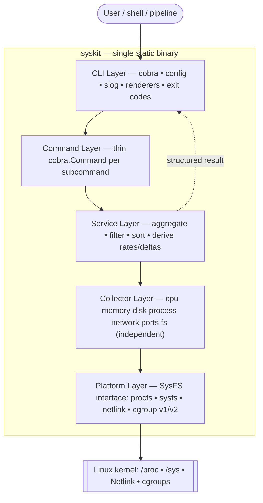
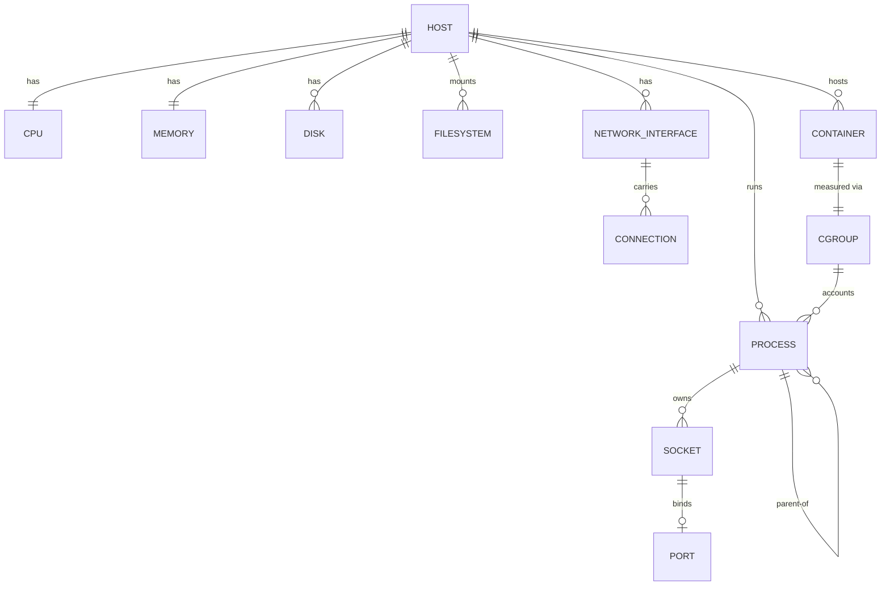

# SysKit Architecture

> Canonical baseline architecture for SysKit, derived strictly from the repository's specs, ADRs, standards, and configuration as of 2026-07-07. SysKit is in its design/specification phase: this document describes the architecture that has been **decided and ratified**, and that the first implementation must build. Where the source specs conflict or are silent, this document states the resolution explicitly and marks it.

---

## 1. Executive Summary

SysKit is a Linux-only, read-only command-line toolkit — a single statically linked Go 1.22+ binary — that inspects system state (CPU, memory, disk, filesystem, processes, network, ports, containers) by reading native kernel interfaces (`/proc`, `/sys`, Netlink, cgroups) directly rather than shelling out to utilities, and renders results as table, JSON, YAML, or an interactive terminal dashboard. It is organized as a strict six-layer architecture (CLI → Command → Service → Collector → Platform → kernel) with independent per-domain collectors behind Go interfaces, holding no persistent state, cache, queue, or background service. This design is chosen for testability (collectors read fixtures through a `SysFS` seam), modularity (a new format or collector is an additive change), and a shared data path that feeds both the non-interactive CLI and the future TUI — deliberately no more machinery than a per-invocation inspection tool requires.

## 2. Context & Constraints

**Purpose.** A fast, consistent, structured alternative to the scattered `top`/`free`/`df`/`ss`/`ip`/`lsof` toolset, and a reference project for Go and Linux internals. (`specs/product.md`)

**Hard constraints (from ADRs, constitution, standards):**

| Constraint | Detail | Source |
|---|---|---|
| Language | Go ≥ 1.22, single static binary | ADR 001 |
| Platform | Linux only; no `runtime.GOOS`/OS build tags | ADR 002 |
| Data source | Native `/proc`, `/sys`, Netlink, cgroups; no shelling out | ADR 003 |
| Scope | Read-only inspection; no cross-platform, GUI, cloud, or admin | product Non-Goals |
| Dependencies | Stdlib-first; only cobra, bubbletea, lipgloss, testify, `golang.org/x/sys/unix` approved; MIT-compatible only | dependency-policy |
| Process | Spec-driven: accepted spec + testable acceptance criteria before code | implementation-readiness |
| Repo boundary | No Go code until the transition PR; CI-enforced | project-structure, ci.yml |
| Delivery | Scrum, sequential milestones v0.1 → v1.0 | plan/ |

**Unknown / unspecified:** numeric performance SLOs, team size and calendar timeline. Tracked in §8.

## 3. High-Level Architecture



**The rule that defines the system:** dependencies flow strictly downward; each layer calls only the layer directly below; lower layers never import higher ones; every boundary is a Go interface so fakes can be injected in tests (ADR 004). One data path serves every presentation — table, JSON, YAML, tests, and the TUI consume the *same* services.

**Typical flow** (`syskit cpu --format json`): CLI parses flags + loads config → command validates and calls CPUService → service asks the CPU collector for a snapshot (two snapshots when utilization is needed) → collector calls `platform.SysFS.ReadFile("proc/stat")` etc. → platform returns raw bytes → collector parses to a typed struct with raw counters preserved → service computes derived utilization → JSON renderer writes to **stdout**; diagnostics/errors go to **stderr**; exit code is mapped from sentinel errors at the CLI boundary.

## 4. Components & Responsibilities

| Layer | Does | Must not do | Key tech |
|---|---|---|---|
| **CLI** | Parse args/flags, load config (defaults←file←env←flags), pick renderer, present errors, assign exit codes, configure `slog` logger, run TUI | Read `/proc`/`/sys` directly; contain business logic | Cobra, Lip Gloss/Bubble Tea, `log/slog` |
| **Command** | Define subcommands, validate flag combinations, map intent to a service call | Perform business logic or I/O | Cobra |
| **Service** | Aggregate collectors, filter/sort, compute rates/deltas/percentages, own any bounded caching | Render output; read kernel interfaces | stdlib |
| **Collector** | Parse one domain's raw bytes into typed, base-unit structs; return domain sentinels | Log, render, read config, shell out, know about other collectors | stdlib |
| **Platform** | The only OS-touching layer: read procfs/sysfs, speak Netlink, read cgroup v1/v2; expose `SysFS` + `RealFS()`/`TestFS()` | Interpret user intent | `golang.org/x/sys/unix` |
| **Kernel interfaces** | Data sources themselves (not SysKit code) | — | `/proc`, `/sys`, Netlink, cgroups |

**Cross-cutting components:**
- **Renderers** (`table`, `json`, `yaml`, `TUI`) — deterministic, golden-file-testable, stdout-only, no data collection. `snake_case` fields, explicit units, RFC 3339 timestamps; post-v1.0 schema is a compatibility contract.
- **Configuration** — optional TOML at `$XDG_CONFIG_HOME/syskit/config.toml` (fallback `~/.config`), `SYSKIT_*` env overrides, per-command `[section]` tables; loaded once at CLI startup and threaded down as plain values; missing file is silent, malformed file is an error.
- **Logging** — `log/slog` text handler to stderr, silent by default, raised by `--verbose`/`--debug`, silenced by `--quiet`; lower layers never log.

### Key interface contracts

```go
// platform — the only OS seam
type SysFS interface {
    ReadFile(name string) ([]byte, error)
    Open(name string) (fs.File, error)
    ReadDir(name string) ([]fs.DirEntry, error)
}
func RealFS() SysFS            // rooted at "/"
func TestFS(fs.FS) SysFS       // rooted at fixtures
var ErrNotFound, ErrPermission, ErrUnsupported error

// collector — snapshot per domain
type Collector interface { Collect() (*model.T, error) }
func NewCollector(fs platform.SysFS) Collector

// render — presentation only
type Renderer interface { Render(w io.Writer, v any) error }
```

### Proposed package layout (created in the transition PR)

```text
cmd/syskit/            main entry → cobra root
internal/cli/          root cmd, global flags, config, logger, exit mapping
internal/cli/command/  one file per subcommand
internal/service/      business logic per domain
internal/collector/    cpu/ memory/ disk/ process/ network/ ports/ fs/
internal/platform/     SysFS, RealFS, netlink client, cgroup reader
internal/render/       table/json/yaml + Renderer
internal/model/        shared typed domain structs
testdata/              cross-package fixtures
scripts/capture-fixtures.sh
```

## 5. Data Model

The domain is **transient system-telemetry snapshots** — no persisted records, no datastore. Structs live in `internal/model` with JSON/YAML tags; raw kernel counters are preserved alongside (never overwritten by) derived values.



| Entity | Representative fields | Source |
|---|---|---|
| Host/System | kernel, os release, uptime, load avg, boot time | `/proc`, uname |
| CPU | cores/threads/sockets, model, arch, flags; per-core user/system/idle/iowait/steal/guest; freq min/cur/max | `/proc/stat`, `/proc/cpuinfo`, sysfs |
| Memory | total/used/free, swap, buffers, caches, available, pressure | `/proc/meminfo` |
| Disk / Filesystem | partitions, usage, mounts, I/O, inode usage, fs type/options | mountinfo, `/proc`, `/sys`, statfs |
| Process | pid, ppid, name, user, resource usage, tree | `/proc/[pid]/*` |
| Network / Connection / Route | iface stats, conn state, routes | Netlink |
| Port / Socket | listening ports, socket state, owner pid | Netlink, `/proc` |
| Container / Cgroup | id, status, resource usage (v1/v2) | Docker API, `/sys/fs/cgroup` |

**Snapshot semantics:** one collector call = one point-in-time snapshot. Rate metrics require two snapshots + a time delta, computed in the service layer so collectors stay stateless.

## 6. Key Design Decisions (ADR summaries)

**ADR 001 — Go 1.22+.** *Context:* need fast startup, single static binary, easy concurrency, strong file/socket stdlib, productive learning language. *Decision:* Go ≥1.22. *Alternatives:* Rust (steeper curve, less iteration speed), C (memory-safety burden), Python (startup/runtime cost), Zig (pre-1.0). *Trade-offs:* GC pauses and a binary-size floor accepted for a read-mostly tool. *Consequences:* static binary, trivial cross-compile, low dependency surface.

**ADR 002 — Linux only.** *Context:* value comes from Linux-specific interfaces with no cross-OS overlap. *Decision:* target Linux exclusively; no OS branching/shims. *Alternatives:* gopsutil-style abstraction (flattens the richness we exist to expose), "portable later" (abstraction tax up front), Linux+BSD. *Trade-offs:* excludes non-Linux users; reversal is expensive. *Consequences:* full use of native interfaces, no CI matrix, concentrated depth.

**ADR 003 — Native interfaces, no shelling out.** *Context:* shelling out is version/locale-fragile and slow. *Decision:* read `/proc`, `/sys`, Netlink, cgroups directly. *Alternatives:* exec+parse tools, hybrid, cgo C library. *Trade-offs:* we maintain parsers and handle kernel quirks. *Consequences:* stable kernel contract, no external tool deps, richer detail, lower overhead.

**ADR 004 — Six-layer architecture, independent collectors.** *Context:* must grow from a few commands to dashboard + plugins while staying testable. *Decision:* six layers, strict downward deps, interface boundaries, independent collectors. *Alternatives:* flat (couples I/O + logic + presentation), two-layer, shared collector registry. *Trade-offs:* indirection and boilerplate; discipline needed to hold the boundary. *Consequences:* testable seams, reuse across CLI+TUI, additive extensibility.

**ADR 005 — Cobra.** *Context:* deep subcommand tree with shared flags and accurate help. *Decision:* Cobra (+pflag), confined to the top two layers. *Alternatives:* stdlib `flag`, urfave/cli, kong, in-house router. *Trade-offs:* one dependency, opinionated. *Consequences:* no hand-rolled dispatch/help/completion; replaceable because isolated.

**ADR 006 — Bubble Tea + Lip Gloss (v0.3).** *Context:* interactive dashboard/`top`/`watch` need a testable, composable TUI. *Decision:* Elm-architecture TUI in the CLI layer over shared services. *Alternatives:* tview (harder to test), termui (chart-centric, less maintained), raw termbox/tcell (reinvent the loop). *Trade-offs:* heaviest dep, Elm learning curve; scoped to v0.3+. *Consequences:* pure `Update` is unit-testable, composable widgets, static binary preserved.

**ADR 007 — Out-of-process plugins (v0.5).** *Context:* extensibility without Go `plugin` ABI pain and with a clear trust boundary. *Decision:* external plugin executables over a versioned JSON protocol; core works without plugins. *Alternatives:* Go `plugin`, static-linking-only, no plugins. *Trade-offs:* protocol/lifecycle work, per-call overhead. *Consequences:* fault isolation, language-agnostic, explicit trust model; deferred until core stabilizes.

**ADR-008 — No storage/cache/queue** (`decisions/008-no-persistent-storage.md`). *Context:* transient, read-only, per-invocation domain. *Decision:* hold no persistent state; only a per-session in-memory previous-snapshot for live modes. *Alternatives:* cache layer, embedded store, event bus. *Trade-offs:* none for current scope. *Consequences:* simplest possible footprint; revisit only if post-1.0 historical data is adopted. Any future storage/cache/queue must supersede this ADR rather than be added incrementally.

## 7. Non-Functional Considerations

**Performance (NFR-1/2/3):** native reads over fork/exec; stream large pseudo-files via `Open`; minimize allocations in hot paths; benchmark parsers with `b.ReportAllocs()`; single static binary with no warm-up. Targets are qualitative — a numeric budget is an open item.

**Reliability:** no panics escape library code; wrap-with-`%w` error chains; partial-failure isolation via `errors.Join` (one collector failing never blanks the result → exit 5); deterministic, golden-tested renderers.

**Concurrency:** services may run independent collectors as goroutines; collectors avoid package-level mutable state; all tests run under `-race`.

**Retry policy (recommended; specs silent):** no retry for procfs/sysfs (deterministic); skip-and-note for `/proc/[pid]` exit races; small bounded retry only for transient Netlink (EINTR/buffer); timeout-and-fail (no retry) for plugin processes.

**Security & safety:** read-only by design — no config changes, no signals/kills, no service management in core scope. Plugins are opt-in, never auto-installed, never loaded from world-writable directories, with a documented trust model. Stdout/stderr strictly separated so structured output is never corrupted.

**Testing (NFR-5):** unit (fixtures), integration (`//go:build linux && integration` against real `/proc`), benchmarks, golden files; ≥80% statement-coverage guideline; CI runs fmt, vet, `-race`, integration, coverage, benchmarks on Linux.

**Exit-code contract (resolves the spec conflict):** adopt the 0–5 table from `error-handling.md` as canonical (0 success, 1 general, 2 usage, 3 permission, 4 unsupported, 5 partial) and correct `cli-conventions.md` to match; codes assigned only at the CLI layer from propagated sentinels.

## 8. Open Questions & Risks

| # | Item | Type | Action |
|---|---|---|---|
| 1 | ~~**Exit-code conflict**: cli-conventions (0–4) vs error-handling (0–5) reassign code 3 differently~~ **RESOLVED** | Risk (contract bug) | Fixed: `specs/cli-conventions.md` and `specs/error-handling.md` now carry the identical canonical 0–5 table (3=Permission, 4=Unsupported, 5=Partial), with `error-handling.md` marked canonical. Runtime enforcement (a test asserting `ErrPermission`→3, `ErrUnsupported`→4, joined partial-failure→5) is tracked separately as **FND-07** in EPIC-00 / sprint-01 and does not block this doc fix. |
| 2 | No numeric performance SLOs | Open question | Define startup/memory budgets, or keep regression-only and state so. |
| 3 | YAML encoding strategy — stdlib vs new dependency — undecided | Open question | Resolve against dependency-policy before v0.2 (YAML lands). |
| 4 | Layer boundary enforced only by review | Risk | Add an import-boundary/architecture test once code exists. |
| 5 | Plugin protocol not yet defined | Deferred | Define before v0.5; keep collectors registrable meanwhile. |
| 6 | Config env-vs-per-command-section interaction underspecified | Open question | Clarify precedence before config is implemented. |
| 7 | Architecture depicted in three docs with minor differences | Risk (drift) | Make `specs/architecture.md` canonical; others link to it. |
| 8 | Team size / calendar timeline not in repo | Open question | Out of architectural scope; owned by `plan/`. |

## 9. What We'd Revisit As the System Grows

- **Import-boundary enforcement.** Move the downward-dependency rule from review discipline to an automated architecture test the moment `internal/` exists.
- **Bounded service caching.** If live modes (`watch`/`top`/`dashboard`) or aggregate diagnostics show repeated reads within one refresh cycle, introduce the explicit, service-owned, bounded cache the collectors spec already anticipates — not before.
- **Historical data / storage.** Only if the post-1.0 "historical data" feature is adopted; it would introduce the project's first datastore and must be weighed against the read-only, single-binary identity.
- **Netlink abstraction depth.** As networking features expand, the platform Netlink client may need a richer typed interface than the initial `SysFS`-style seam.
- **Plugin protocol versioning.** Once real plugins exist, revisit protocol version negotiation and migration windows.
- **YAML and additional formats.** NDJSON/Prometheus/field-selection are listed as future extensions; revisit the renderer interface if streaming output is added.
- **Output-schema freeze at v1.0.** JSON/YAML field names/types become a compatibility commitment; a schema review is warranted just before tagging v1.0.

---

*This document is the canonical baseline architecture. It reflects decisions ratified in `decisions/` and specified in `specs/`; where it resolves a conflict or fills a gap, that is marked inline (§7, §8). Implementation details will be refined during the v0.1 transition, but the layered structure, native-interface rule, and read-only boundary are foundational and stable.*
