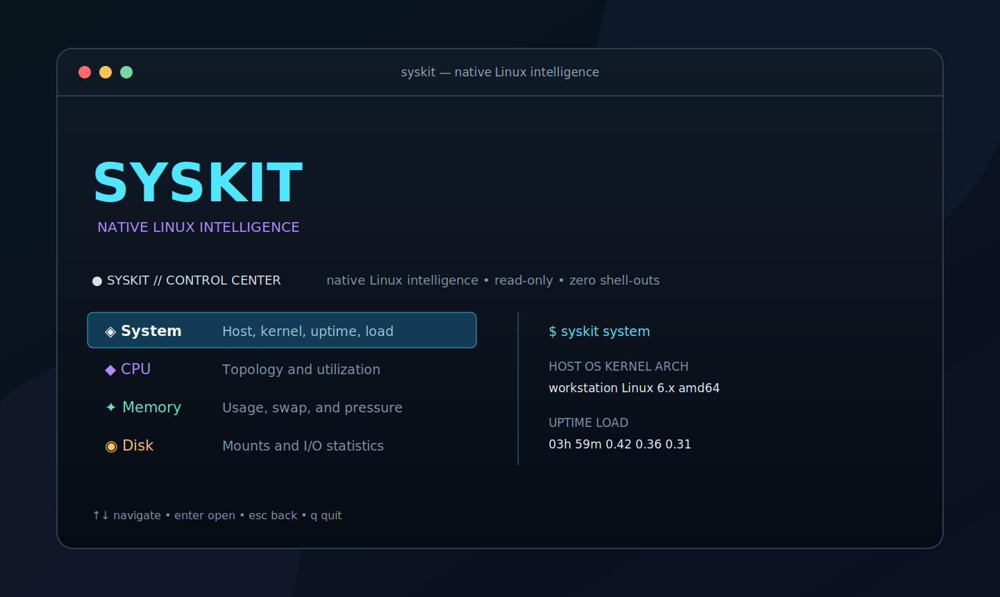

# SysKit

> A modern, Linux-first command-line toolkit for system inspection, resource monitoring, and diagnostics — built with Go.

[](LICENSE)
[](https://go.dev)
[](https://kernel.org)
[]()

<p align="center">
  <strong>Native Linux intelligence for the terminal.</strong><br>
  Inspect live system state with one fast, read-only CLI.
</p>

<p align="center">
  <a href="#install-in-one-command">Install</a> ·
  <a href="#see-the-terminal-experience">See it in action</a> ·
  <a href="docs/command-reference.md">Commands</a> ·
  <a href="docs/getting-started.md">Documentation</a>
</p>

## Overview

SysKit is an open-source command-line toolkit designed for backend engineers, DevOps professionals, and Linux enthusiasts who need fast, reliable, and consistent access to system information.

Rather than wrapping existing Linux utilities, SysKit interacts directly with native Linux interfaces — `/proc`, `/sys`, Netlink, and other kernel APIs — to collect and present system data. This approach provides better performance, richer detail, and a deeper understanding of the underlying operating system.

SysKit is both a practical daily-use tool and a long-term educational project for mastering Go, Linux internals, CLI development, and systems programming.

## The terminal identity

The wordmark below uses the exact glyph art rendered by SysKit's interactive
control center. In a color-capable terminal, each line receives the rotating
cyan, violet, mint, amber, and coral accents used throughout the TUI.

```text
███████╗██╗   ██╗███████╗██╗  ██╗██╗████████╗
██╔════╝╚██╗ ██╔╝██╔════╝██║ ██╔╝██║╚══██╔══╝
███████╗ ╚████╔╝ ███████╗█████╔╝ ██║   ██║
╚════██║  ╚██╔╝  ╚════██║██╔═██╗ ██║   ██║
███████║   ██║   ███████║██║  ██╗██║   ██║
╚══════╝   ╚═╝   ╚══════╝╚═╝  ╚═╝╚═╝   ╚═╝

● SYSKIT // CONTROL CENTER  native Linux intelligence  •  read-only  •  zero shell-outs
```

## See the terminal experience

<p align="center">
  
</p>

Run `syskit` in an interactive terminal to browse the control center, or use a
single command for a focused result. Every command reads native Linux interfaces
directly—never parsed output from system utilities.

## Install in one command

On a supported Linux system, install the latest stable release with:

```sh
curl -fsSL https://raw.githubusercontent.com/Mersad-Moghaddam/syskit/main/scripts/install.sh | sh
```

The installer detects `amd64` or `arm64`, downloads the matching release,
verifies it with the release's SHA-256 checksum, and installs `syskit` and its
manual page under `/usr/local`. It asks for `sudo` only when required. After it
finishes, verify the installation with `syskit version`.

To install a particular release, or to avoid `sudo` by using a user-local
prefix, download the script first and run it with explicit variables:

```sh
curl -fsSLO https://raw.githubusercontent.com/Mersad-Moghaddam/syskit/main/scripts/install.sh
SYSKIT_VERSION=v1.0.0 SYSKIT_INSTALL_PREFIX="$HOME/.local" sh install.sh
```

For the complete requirements, package-manager options, manual checksum steps,
and removal instructions, continue to [detailed installation](#installation).

## Philosophy

SysKit follows a **Specification-Driven Development (SDD)** workflow. Implementation comes after documentation and architecture. Every feature begins as a specification, is reviewed for correctness and consistency, and only then moves into code.

This approach ensures:

- Deliberate, well-understood design decisions
- A codebase that remains maintainable as it grows
- Documentation that stays in sync with the implementation
- A project that serves as both a tool and a learning resource

## Goals

- **Unified Interface** — Provide a single, consistent CLI for common Linux inspection and monitoring tasks.
- **Native Data Collection** — Read directly from kernel interfaces instead of parsing shell command output.
- **Performance** — Deliver fast startup, low memory footprint, and minimal overhead.
- **Modularity** — Build an architecture that supports independent, composable subsystems.
- **Extensibility** — Support plugins, custom collectors, and multiple output formats.
- **Education** — Serve as a reference project for Go engineering, Linux internals, and CLI design.

## Features

| Category | Features |
|---|---|
| **System** | Host information, kernel version, uptime, load averages |
| **CPU** | Core count, utilization, frequency, per-core statistics |
| **Memory** | Physical/swap usage, buffers, caches, memory pressure |
| **Disk** | Partition layout, usage, I/O statistics, mount points |
| **Process** | Process listing, tree view, resource usage, signals |
| **Network** | Interface statistics, connections, routing, DNS |
| **Ports** | Listening ports, socket states, associated processes |
| **Filesystem** | Inode usage, filesystem types, mount options |
| **Diagnostics** | System health checks, resource bottleneck detection |
| **Dashboard** | Interactive terminal UI with real-time monitoring |
| **Control center** | Hierarchical keyboard and mouse menu for every command family |
| **Output** | Table, JSON, YAML, and plain-text output formats |
| **Plugins** | User-defined collectors and custom extensions |
| **Containers** | Cgroup-derived container IDs, processes, and resource counters |

## Design Principles

- **Linux First** — Built exclusively for Linux. No cross-platform abstraction layers.
- **Native APIs First** — Prefer `/proc`, `/sys`, and Netlink over shelling out to external commands.
- **Performance Matters** — Minimize allocations, avoid unnecessary work, benchmark critical paths.
- **Keep It Modular** — Each subsystem is independent and self-contained.
- **Test Everything** — Unit tests, integration tests, and benchmarks for every component.
- **Documentation First** — Specs before code. Every feature is designed before it is built.
- **Clean Go** — Idiomatic Go. No frameworks, no magic, no unnecessary abstractions.
- **Minimal Dependencies** — Rely on the standard library wherever possible.
- **Consistent CLI Experience** — Predictable flags, uniform output, clear error messages.

## Technology Stack

| Component | Technology |
|---|---|
| Language | [Go](https://go.dev) 1.26.3+ |
| Data Sources | `/proc`, `/sys`, Netlink, kernel APIs |
| CLI Framework | [Cobra](https://github.com/spf13/cobra) |
| Terminal UI | [Bubble Tea](https://github.com/charmbracelet/bubbletea) |
| Styling | [Lip Gloss](https://github.com/charmbracelet/lipgloss) |
| Testing | Go standard `testing` package, [testify](https://github.com/stretchr/testify) |

## Project Status

**v1.0.0 stable release**

SysKit v1.0.0 includes native host/process/network inspection, live
dashboard/watch/top views, explainable diagnostics, cgroup-derived containers,
and explicit out-of-process plugins with table, JSON, and YAML output. Its CLI,
configuration, exit-code, plugin, and structured-output contracts are frozen
under Semantic Versioning. Tagged releases publish reproducible archives,
deb/rpm packages, AUR metadata, checksums, and `syskit(1)`.

See the [Roadmap](specs/roadmap.md) for completed milestones and future ideas.

Run `syskit` with no subcommand in an interactive terminal to open the control
center. Its animated SysKit wordmark adapts to compact terminals, every action
has its own icon and accent, and selected commands keep that theme through
loading, output, dashboard, top, and watch views. Browse with the arrow keys or
mouse, press Enter to open or run an item, and use Escape or Left to return.

## Requirements

- A supported Linux system on `amd64`/`x86_64` or `arm64`/`aarch64`.
- Standard Linux kernel interfaces mounted at `/proc` and `/sys`.
- A terminal for interactive commands such as `dashboard`, `top`, `watch`, and
  the control center.
- `sudo` or root access only to install a system-wide binary. SysKit itself is
  read-only and most inspection commands work as an ordinary user.
- For the download-based instructions: `curl`, `tar`, and `sha256sum` (normally
  provided by the base system packages on Linux distributions).

Some process and socket ownership data can be hidden by kernel permissions.
SysKit reports partial results where applicable; run only the specific command
with elevated privileges if you need access that your normal user lacks.

## Installation

Tagged releases are published on the
[GitHub Releases page](https://github.com/Mersad-Moghaddam/syskit/releases).
Each release includes static Linux archives for amd64 and arm64, Debian and RPM
packages, AUR metadata, and a `SHA256SUMS` file. Choose the method that matches
your distribution.

### 1. Portable archive (any supported Linux distribution)

This is the most broadly compatible installation method. It installs the
binary and the manual page under `/usr/local`, without changing files managed
by your distribution's package manager.

```sh
VERSION=v1.0.0
case "$(uname -m)" in
  x86_64) ARCH=amd64 ;;
  aarch64|arm64) ARCH=arm64 ;;
  *) echo "unsupported architecture: $(uname -m)" >&2; exit 1 ;;
esac

BASE_URL="https://github.com/Mersad-Moghaddam/syskit/releases/download/$VERSION"
ARCHIVE="syskit_${VERSION#v}_linux_${ARCH}.tar.gz"
curl -fLO "$BASE_URL/SHA256SUMS"
curl -fLO "$BASE_URL/$ARCHIVE"
sha256sum -c SHA256SUMS --ignore-missing
tar -xzf "$ARCHIVE"
sudo install -Dm 0755 "syskit_${VERSION#v}_linux_${ARCH}" /usr/local/bin/syskit
sudo install -Dm 0644 syskit.1 /usr/local/share/man/man1/syskit.1
```

The checksum command must report `OK` for the downloaded archive before you
install it. Release artifacts are checksum-verifiable but are not currently
cryptographically signed.

### 2. Debian, Ubuntu, and other Debian-family distributions

Download the `.deb` matching your architecture and verify it against the same
release's `SHA256SUMS` before installation. For amd64:

```sh
VERSION=1.0.0
BASE_URL="https://github.com/Mersad-Moghaddam/syskit/releases/download/v$VERSION"
PACKAGE="syskit_${VERSION}_amd64.deb"
curl -fLO "$BASE_URL/SHA256SUMS"
curl -fLO "$BASE_URL/$PACKAGE"
sha256sum -c SHA256SUMS --ignore-missing
sudo apt install "./$PACKAGE"
```

For 64-bit ARM, replace `amd64` with `arm64`. `apt` resolves any package
dependencies and places `syskit` in `/usr/bin/syskit`.

### 3. Fedora, RHEL, Rocky Linux, AlmaLinux, and other RPM-family distributions

For x86_64 systems:

```sh
VERSION=1.0.0
BASE_URL="https://github.com/Mersad-Moghaddam/syskit/releases/download/v$VERSION"
PACKAGE="syskit-${VERSION}-1.x86_64.rpm"
curl -fLO "$BASE_URL/SHA256SUMS"
curl -fLO "$BASE_URL/$PACKAGE"
sha256sum -c SHA256SUMS --ignore-missing
sudo dnf install "./$PACKAGE"
```

For 64-bit ARM, replace `x86_64` with `aarch64`. On RPM systems that use
`zypper`, install the already verified local file with
`sudo zypper install "./$PACKAGE"`.

### 4. Arch Linux and derivatives (AUR metadata)

SysKit publishes reviewable metadata for the `syskit-bin` AUR package. Download
the archive for the release, verify it, then build and install it with
`makepkg` (do not run `makepkg` as root):

```sh
VERSION=1.0.0
BASE_URL="https://github.com/Mersad-Moghaddam/syskit/releases/download/v$VERSION"
PACKAGE="syskit_${VERSION}_aur.tar.gz"
curl -fLO "$BASE_URL/SHA256SUMS"
curl -fLO "$BASE_URL/$PACKAGE"
sha256sum -c SHA256SUMS --ignore-missing
mkdir "syskit-bin-$VERSION"
tar -xzf "$PACKAGE" -C "syskit-bin-$VERSION"
cd "syskit-bin-$VERSION"
makepkg -si
```

`makepkg` downloads the architecture-appropriate release archive and verifies
the checksum pinned in `PKGBUILD`.

### 5. Build from source

Use this option for development, unreleased changes, or when you prefer to
compile the binary yourself. It requires Go 1.26.3 or newer and Git.

```sh
git clone https://github.com/Mersad-Moghaddam/syskit.git
cd syskit
git checkout v1.0.0
go test -race ./...
go build -trimpath \
  -ldflags "-s -w -X github.com/Mersad-Moghaddam/syskit/internal/cli.version=v1.0.0" \
  -o syskit ./cmd/syskit
sudo install -Dm 0755 syskit /usr/local/bin/syskit
sudo install -Dm 0644 docs/man/syskit.1 /usr/local/share/man/man1/syskit.1
```

To build the current development branch instead, omit `git checkout v1.0.0` and
the version linker flag. A development build reports `dev` from `syskit version`.

### Verify the installation

```sh
syskit version
syskit --help
syskit system
syskit cpu --format json
man syskit
```

`syskit` with no arguments opens the interactive control center when both input
and output are terminals. For scripting, prefer the stable JSON or YAML output:

```sh
syskit memory --format json
syskit process --sort cpu --limit 20 --format yaml
syskit ports --listening
```

See the [command reference](docs/command-reference.md) for the full command and
flag contract, including interactive keyboard controls and configuration.

### Upgrade or remove

To upgrade an archive installation, repeat the portable-archive steps with the
new release version. Package-manager installations can be upgraded by installing
the newer local package using the same commands above.

```sh
# Portable archive installation
sudo rm -f /usr/local/bin/syskit /usr/local/share/man/man1/syskit.1

# Debian/Ubuntu package installation
sudo apt remove syskit

# RPM package installation
sudo dnf remove syskit

# Arch package installation
sudo pacman -Rns syskit-bin
```

Use only the removal command for the method you originally used. Removing
SysKit does not remove its optional configuration or plugin directories.

## Configuration and shell completion

SysKit works with no configuration. When needed, configuration is loaded in
this order: command-line flags, `SYSKIT_*` environment variables, then
`$XDG_CONFIG_HOME/syskit/config.toml` (or `~/.config/syskit/config.toml`), and
finally built-in defaults.

Generate completion for your current shell and place it in the directory used
by that shell. For example, to enable Bash completion for the current session:

```sh
source <(syskit completion bash)
```

The CLI can generate `bash`, `zsh`, `fish`, and `powershell` completion source.
Run `syskit completion <shell> --help` or consult your shell's documentation for
the persistent completion directory on your distribution.

## Project Structure

```text
syskit/
├── cmd/syskit/         # CLI entry point (main)
├── internal/           # Application internals (not importable externally)
│   ├── cli/            # Cobra command wiring, config, logger, exit mapping
│   │   └── command/    # One file per subcommand
│   ├── collector/      # Built-in domain collectors
│   ├── platform/       # Linux procfs, sysfs, Netlink, cgroup adapters (SysFS)
│   ├── render/         # Table, JSON, YAML, TUI rendering
│   ├── service/        # Aggregation and domain logic
│   └── model/          # Shared typed domain structs
├── testdata/           # Shared fixtures
├── .github/            # GitHub templates and CI workflows
├── docs/               # User-facing documentation and maintainer guides
├── contracts/          # Machine-readable v1 CLI and output contracts
├── specs/              # Specifications and architecture documents
│   ├── constitution.md # Engineering principles
│   ├── product.md      # Product overview
│   ├── roadmap.md      # Development milestones
│   ├── architecture.md # System architecture
│   └── features/       # Individual feature specifications
├── learning/           # Practical Linux, Go, and SysKit engineering course
├── standards/          # Engineering standards and review policies
├── decisions/          # Architecture Decision Records
├── scripts/            # Development and build scripts
├── LICENSE
├── README.md
└── .gitignore
```

The Go module (`github.com/Mersad-Moghaddam/syskit`) targets Go 1.26.3+ and builds
to a single static binary. Dependencies flow strictly downward
(CLI → Command → Service → Collector → Platform → kernel); lower layers never
import higher ones.

## Documentation Map

- [Getting started](docs/getting-started.md)
- [Command reference](docs/command-reference.md)
- [Plugin authoring](docs/plugin-authoring.md)
- [Architecture overview](docs/architecture.md)
- [Developer onboarding](docs/developer-onboarding.md)
- [Performance baseline](docs/performance.md)
- [v1 compatibility contract](docs/compatibility.md)
- [syskit(1) manual source](docs/man/syskit.1)
- [v1.0.0 release notes](docs/releases/v1.0.0.md)
- [Product overview](specs/product.md)
- [Feature specifications](specs/features/)
- [Collector architecture](specs/collectors.md)
- [Rendering architecture](specs/rendering.md)
- [Plugin architecture](specs/plugin-architecture.md)
- [Learning Center](learning/README.md)
- [Learning roadmap](learning/roadmap.md)
- [Implementation readiness](docs/implementation-readiness.md)

## Vision

SysKit aims to become a reliable daily companion for backend engineers and Linux users — a tool that provides a modern, fast, and thoughtful command-line experience for system inspection, monitoring, and diagnostics.

Beyond the tool itself, SysKit is designed to be a living reference for building well-architected Go applications that interact deeply with the Linux kernel.

## Contributing

SysKit is in its implementation phase. Contributions are
welcome across code, specs, architecture, Linux explanations, documentation, and
repository process. Production code must follow the architecture boundaries and
meet the [Definition of Done](standards/definition-of-done.md). See
[docs/contributing.md](docs/contributing.md).

## License

This project is licensed under the [MIT License](LICENSE).

---

*Built with care for Linux, Go, and the terminal.*
