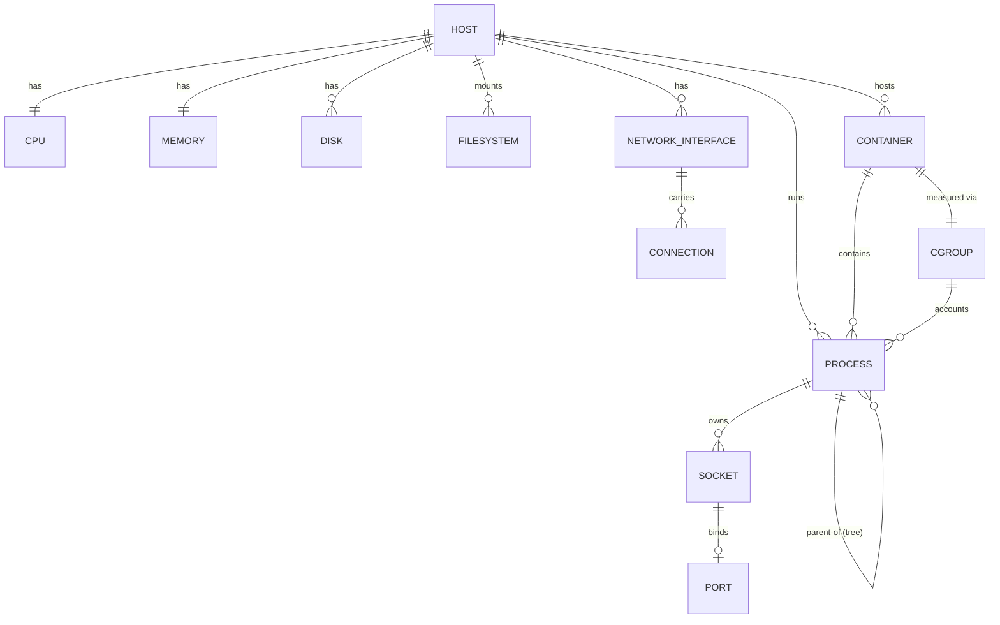

# Phase 2 — Requirements Extraction

*Point-in-time analysis that informed ARCHITECTURE.md; retained here for historical reference.*

> Requirements drawn strictly from `specs/`, `decisions/`, `standards/`, and `plan/`. Where the documentation is silent, the item is deferred to "Open Questions" rather than assumed.

## 1. Functional Requirements

Grouped by roadmap milestone (`specs/roadmap.md`), with behavioral detail from `specs/features/*`.

### v0.1 — Foundation
- **FR-1** `syskit system` — host info, kernel version, OS release, uptime, load averages, boot time.
- **FR-2** `syskit cpu` — logical/physical cores, sockets, model, architecture, flags summary; current/min/max frequency where sysfs exposes it; aggregate and per-core utilization when two samples exist (`--per-core`). Raw counters kept separate from derived percentages. (`specs/features/cpu.md`)
- **FR-3** `syskit memory` — physical/swap usage, buffers, caches, available memory, pressure indicators.
- **FR-4** `syskit disk` — partition layout, filesystem usage, mount points, I/O statistics.
- **FR-5** Output in **table** and **JSON** for all v0.1 commands.

### v0.2 — Processes & Networking
- **FR-6** `syskit process` — listing, filter by name/PID/user, per-process resource usage.
- **FR-7** `syskit process tree` — process-tree visualization.
- **FR-8** `syskit network` — interface stats, active connections, routing table (via Netlink).
- **FR-9** `syskit ports` — listening ports, socket states, associated processes.
- **FR-10** Consistent **filtering/sorting** flags (`--sort`, `--reverse`, `--limit`, `--filter`) and **YAML** output. (`specs/cli-conventions.md`)

### v0.3 — Real-Time Monitoring
- **FR-11** `syskit dashboard` — interactive TUI with live-updating widgets.
- **FR-12** `syskit watch <command>` — continuous refresh at a configurable interval.
- **FR-13** `syskit top` — interactive process monitor with sorting/filtering.

### v0.4 — Containers
- **FR-14** `syskit docker` and `docker inspect <id>` — container listing, resource usage, status, detail.
- **FR-15** Container-aware process views and cgroup-based resource monitoring.

### v0.5 — Extensibility
- **FR-16** Out-of-process plugin discovery/loading, versioned JSON protocol, custom collector registration; core commands must work without plugins. (`specs/plugin-architecture.md`, ADR 007)

### Cross-cutting functional requirements (all versions)
- **FR-17** Every non-interactive command supports `--format table|json|yaml`. (`specs/features/output-formats.md`)
- **FR-18** Optional TOML configuration with fixed precedence flags > env (`SYSKIT_*`) > file > defaults; zero-config must work; per-command `[section]` overrides. (`specs/configuration.md`)
- **FR-19** Consistent global flags: `--format`, `--config`, `--color`, `--no-header`, `--watch`, `--interval`, `--verbose`, `--quiet`. (`specs/cli-conventions.md`)
- **FR-20** Structured, leveled diagnostics on **stderr** only; silent success by default. (`specs/logging-strategy.md`)
- **FR-21** Partial-failure handling: aggregate commands report what succeeded and surface what failed via joined errors. (`specs/error-handling.md`)

## 2. Non-Functional Requirements

Only items with explicit evidence are listed.

| # | Category | Requirement | Evidence |
|---|---|---|---|
| NFR-1 | Performance | Fast startup, low memory footprint, minimize allocations in hot paths, buffered I/O, benchmark critical paths | constitution 3; testing-strategy benchmarks |
| NFR-2 | Performance | Native kernel reads instead of fork/exec of external tools (avoid per-call subprocess overhead) | ADR 003 |
| NFR-3 | Portability | Single statically linked binary, no runtime deps; trivial cross-compile within Linux archs | ADR 001 |
| NFR-4 | Platform | Linux-only; fail cleanly on non-Linux, no graceful cross-OS degradation | ADR 002 |
| NFR-5 | Testability | Unit + integration + benchmark + golden-file tests; all pass under `-race`; ≥80% statement coverage guideline | testing-strategy |
| NFR-6 | Maintainability | Strict downward layer dependencies; independent collectors; interfaces at boundaries | ADR 004 |
| NFR-7 | Compatibility | Post-v1.0 JSON/YAML field names/types are a stability contract; changes need a major version | rendering; cli-conventions; versioning standard |
| NFR-8 | Usability | Consistent flags, predictable output, accurate auto-generated help, color follows TTY/`NO_COLOR` | constitution 9; cli-conventions |
| NFR-9 | Security/Safety | Read-only tool: never modifies config, kills processes, or manages services in core scope | product Non-Goals; docs/architecture Operating Boundaries |
| NFR-10 | Security | Plugins opt-in, never auto-installed, never loaded from world-writable dirs; trust model documented | plugin-architecture; ADR 007 |
| NFR-11 | Observability | Stdout (data) and stderr (diagnostics) strictly separated for pipeline-safety | logging-strategy |
| NFR-12 | Minimal deps | Stdlib-first; each dependency justified against a 7-criterion policy and recorded | constitution 8; dependency-policy |

**No explicit numeric SLOs** (latency ms, throughput, availability %, cost budgets) appear anywhere. Performance is stated qualitatively ("instant", "minimal footprint") and enforced via benchmarks, not thresholds → Open Question.

## 3. Constraints

| Constraint | Detail | Source |
|---|---|---|
| Language/toolchain | Go ≥ 1.22, tracked via `go` directive; no features newer than the declared minimum | ADR 001 |
| Platform | Linux exclusively; no `//go:build` OS conditionals, no compatibility shims | ADR 002 |
| Data acquisition | Native interfaces only; shelling out to `ps`/`df`/`ss`/`ip`/`free` is out of scope | ADR 003; collectors |
| Dependencies | Only cobra, bubbletea, lipgloss, testify, `golang.org/x/sys/unix` approved; MIT-compatible licenses only (no GPL/AGPL) | dependency-policy |
| Process | Spec-driven: a feature needs an accepted spec, defined CLI, output examples, edge cases, testable acceptance criteria, identified data sources, and planned fixtures before coding | implementation-readiness; definition-of-ready |
| Repo boundary | No `cmd/`, `internal/`, `pkg/`, `main.go`, or `.go` files until the implementation-transition PR; enforced by CI | project-structure; ci.yml |
| Scope | No cross-platform, no GUI, no cloud integration, not a replacement for `perf`/`strace`/`bpftrace`, no system administration | product Non-Goals |
| Delivery | Scrum: milestone-based, sequential v0.1→v1.0, sprint-boxed; backlog is the source of truth | plan/README |
| Team/timeline | Not specified in the repo. ADRs dated 2026-07-01; today 2026-07-07. No named team size or deadlines → Open Question |

## 4. Initial Domain Model

The domain is **system telemetry snapshots**. There is no persisted business data — entities are transient, produced per invocation. Core entities inferred from feature specs and architecture:

| Entity | Key attributes (from specs) | Primary source |
|---|---|---|
| Host/System | kernel version, OS release, uptime, load averages, boot time | `/proc`, uname |
| CPU | logical/physical cores, sockets, model, arch, flags; per-core counters (user/system/idle/iowait/steal/guest); freq min/cur/max | `/proc/stat`, `/proc/cpuinfo`, `/sys/devices/system/cpu` |
| Memory | total/used/free, swap, buffers, caches, available, pressure | `/proc/meminfo` |
| Disk | partitions, usage, mount points, I/O stats | `/proc`, `/sys`, mountinfo |
| Filesystem | type, inode usage, mount options | mountinfo, statfs |
| Process | pid, ppid, name, user, resource usage; tree relationships | `/proc/[pid]/*` |
| Network interface / Connection / Route | interface stats, connection state, routing | Netlink |
| Port / Socket | listening ports, socket state, owning process | Netlink, `/proc` |
| Container | id, status, resource usage | Docker API + cgroups |
| Cgroup | resource accounting (v1/v2) | `/sys/fs/cgroup` |

**Snapshot semantics** (collectors): most collector calls return a point-in-time snapshot; rate metrics (CPU %, network throughput) require two snapshots and a time delta, computed in the service layer.

## 5. Open Questions (deferred, no evidence)

- Concrete performance targets (startup ms, memory ceiling) — only qualitative goals exist.
- Team size, roles, and delivery timeline in calendar terms — `plan/` defines sprints but not dates/staffing in the files reviewed.
- Exit-code contract conflict between `cli-conventions.md` (0–4) and `error-handling.md` (0–5) — needs reconciliation before v0.1.
- Whether YAML uses stdlib-only encoding or an approved dependency — flagged as "to be reviewed" in output-formats spec.
