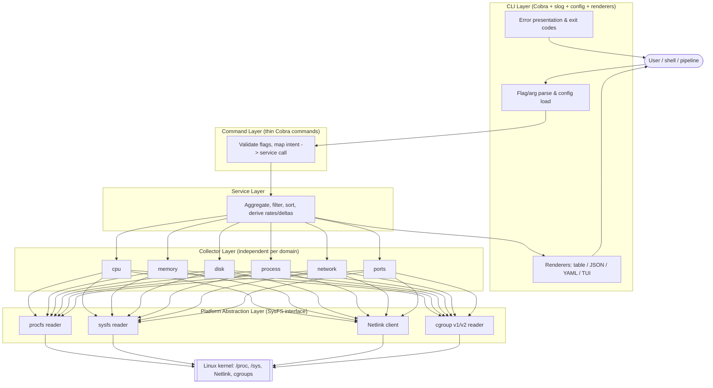

# Phase 3 — Current State Analysis

*Point-in-time analysis that informed ARCHITECTURE.md; retained here for historical reference.*

> The "current architecture" of SysKit is a **documented, ratified design with zero implementation**. This phase documents that documentation-as-artifact honestly: what is decided, how it is intended to flow, what is genuinely strong about it, and where the specs themselves contain gaps, conflicts, or risk.

## 1. Current State in One Sentence

SysKit today is a **planning repository**: an accepted six-layer architecture (ADR 004), seven ADRs, twelve+ specs, engineering standards, a Scrum delivery plan, and a CI guard that forbids any Go code — but no `go.mod`, no `main.go`, and no collectors, services, or commands implemented.

## 2. Component Diagram (planned architecture, as specified)



**Dependency rule (ADR 004):** each layer calls only the layer directly below; lower layers never import higher ones. Boundaries are Go interfaces so fakes can be injected in tests.

## 3. Data Flow (specified, `syskit cpu --format json`)

```text
1. CLI parses `cpu` + `--format json`; loads config (defaults<-file<-env<-flags).
2. Command validates flag combos, calls CPUService.
3. Service asks CPU collector for a snapshot (two snapshots if utilization needed).
4. Collector calls platform SysFS.ReadFile("proc/stat"), ("proc/cpuinfo"), sysfs topology.
5. Platform reads kernel pseudo-files; returns raw bytes.
6. Collector parses bytes -> typed CPUInfo struct (raw counters preserved).
7. Service computes derived utilization % from the delta.
8. JSON renderer writes machine-readable data to STDOUT.
   Diagnostics (if --verbose/--debug) and errors go to STDERR.
   Exit code derived from sentinel errors at the CLI boundary.
```

The same service result is intended to feed table, JSON, YAML, tests, and the future TUI — one data path, many presentations.

## 4. Strengths of the Current (Documented) Architecture

1. **Decisions are captured with rationale and alternatives.** All seven ADRs record Context → Decision → Consequences → Alternatives. The "why" survives, which is exactly what a new engineer needs.
2. **Testability is designed in, not bolted on.** The `SysFS` interface (testing-strategy) means collectors read fixtures in tests and `/` in production with identical code — no `runtime.GOOS`, no live-host dependence. Golden files pin output contracts.
3. **Clean separation of concerns.** Collection, business logic, and presentation are distinct layers; logging and config are explicitly CLI-layer-only; collectors never log and never render. This is internally consistent across error-handling, logging, and rendering specs.
4. **Independent collectors** enable parallel development and are the honest foundation for the later plugin boundary — the extensibility story is not retrofitted.
5. **Proportional scope discipline.** Product Non-Goals explicitly rule out cross-platform, GUI, cloud, and admin features. Read-only boundary is stated repeatedly. This resists scope creep.
6. **Pipeline-correct I/O contract.** Strict stdout(data)/stderr(diagnostics) separation, `NO_COLOR`/TTY handling, and stable field names make the tool scriptable by design.
7. **Dependency minimalism with an audit trail.** Only five dependencies approved, each mapped to a capability the stdlib lacks, each license-checked against MIT.

## 5. Weaknesses, Inconsistencies, and Architectural Debt

| # | Issue | Evidence | Severity | Note |
|---|---|---|---|---|
| W-1 | **Conflicting exit-code contracts.** `cli-conventions.md` defines 0–4 (3 = partial data, 4 = unsupported); `error-handling.md` defines 0–5 (3 = permission, 4 = unsupported, 5 = partial). The two tables assign different meanings to code 3. | both specs | High | Must reconcile before v0.1; scripts depend on exit codes as a contract. |
| W-2 | **Layer indirection cost is real for trivial commands.** A simple `syskit cpu` traverses command → service → collector → platform. ADR 004 acknowledges this "ceremony." | ADR 004 Negative | Medium | Accepted trade-off; risk is over-abstraction if enforced dogmatically on tiny features. |
| W-3 | **Discipline-dependent boundary.** The downward-only rule is enforced only by review, not by tooling. "It is easy to just read a file from a command under time pressure." | ADR 004 Negative | Medium | Recommend an import-linter / architecture test once code exists. |
| W-4 | **No numeric performance targets.** "Fast" and "low footprint" are unquantified; benchmarks track regressions but against no budget. | constitution 3; testing-strategy | Low/Med | Hard to define "done" for NFR-1 objectively. |
| W-5 | **YAML strategy undecided.** output-formats spec flags "YAML dependency policy must be reviewed"; no YAML lib is in the approved list. | output-formats; dependency-policy | Low | Decision needed at v0.2. |
| W-6 | **Plugin protocol undefined.** ADR 007 and plugin spec set direction (out-of-process, versioned JSON) but defer the actual protocol to "before the plugin milestone." | ADR 007 | Low (deferred) | Correctly deferred; not debt yet. |
| W-7 | **Config per-command precedence subtlety.** configuration.md resolves flag → env → per-command section → global → default, but env is global-only; interaction of a global env var with a per-command file section is not fully worked through. | configuration.md | Low | Clarify before config is implemented. |
| W-8 | **Docs duplication drift risk.** Architecture is described in `specs/architecture.md`, `docs/architecture.md`, and ADR 004 with slightly different layer/renderer depictions (e.g. renderers shown as a side-branch off services in docs vs. inside CLI layer in the ADR). | those three files | Low | Keep one canonical source to prevent divergence. |

## 6. What Is *Not* Debt (correctly deferred)

- Absence of `go.mod`, `cmd/`, collectors — intentional and CI-enforced, not an omission.
- Plugin protocol, container specifics, remote monitoring — explicitly roadmap-later.
- No cache/queue/broker — none is needed for a read-only, per-invocation CLI (see Phase 4).

## 7. Assessment

The design is **coherent, well-justified, and appropriately scoped** for its stated purpose. Its principal real risks are (a) the exit-code conflict (a genuine contract bug in the specs), and (b) enforcement of the layering rule once implementation starts. Both are addressable before or during the v0.1 transition PR. Nothing in the current state shows over-engineering *for what the specs commit to* — the six layers are justified by the multi-presentation (CLI + TUI) and plugin requirements, not adopted speculatively.
