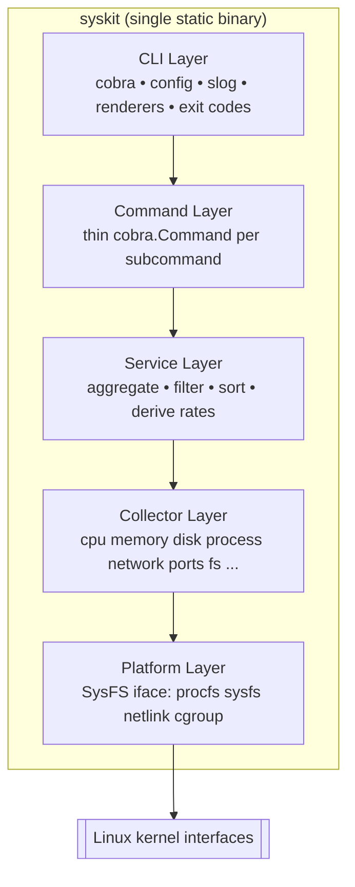

# Phase 4 — Baseline Architecture Design

*Point-in-time analysis that informed ARCHITECTURE.md; retained here for historical reference.*

> This is the **baseline architecture SysKit should build** for its first implementation (v0.1) and grow into through v0.5. It ratifies the design the specs already describe, fills the gaps Phase 3 surfaced, and justifies every decision against the project's actual — not hypothetical — needs. Where the specs are silent or conflicting, a concrete recommendation is given and marked as such.

## 1. High-Level Design

A single statically linked Go binary with a **six-layer, strictly downward dependency graph** and **independent per-domain collectors**. No servers, no persistent storage, no background workers — the tool runs, reads kernel interfaces, renders, and exits.



### Module boundaries (proposed package layout — created in the transition PR)

```text
syskit/
├── go.mod                       # module github.com/<owner>/syskit, go 1.22
├── main.go                      # calls cmd.Execute()
├── cmd/
│   └── syskit/                  # thin: wires cobra root, delegates to internal/cli
├── internal/
│   ├── cli/                     # root cmd, global flags, config load, logger, exit mapping
│   │   └── command/             # one file per subcommand (system, cpu, memory, disk, ...)
│   ├── service/                 # SystemService, CPUService, ... (business logic)
│   ├── collector/               # cpu/, memory/, disk/, process/, network/, ports/, fs/
│   ├── platform/                # SysFS interface, RealFS, netlink client, cgroup reader
│   ├── render/                  # table, json, yaml renderers + Renderer interface
│   └── model/                   # shared typed domain structs (CPUInfo, MemInfo, ...)
├── testdata/                    # shared fixtures where cross-package
└── scripts/capture-fixtures.sh  # fixture capture with provenance
```

Rationale for `internal/`: everything except the module path and `cmd/` entry is unexported to the outside world, preventing the layered packages from becoming an accidental public API before v1.0 (versioning standard).

## 2. Interface Contracts (the load-bearing seams)

The architecture rests on three interfaces. These are the contracts a new engineer must respect.

### 2.1 Platform — `SysFS` (the only OS-touching seam)

```go
// internal/platform
type SysFS interface {
    ReadFile(name string) ([]byte, error)      // e.g. "proc/stat"
    Open(name string) (fs.File, error)         // stream large pseudo-files
    ReadDir(name string) ([]fs.DirEntry, error)// e.g. enumerate "proc" PIDs
}

func RealFS() SysFS                 // rooted at "/"
func TestFS(fsys fs.FS) SysFS       // rooted at a fixtures dir

var (
    ErrNotFound    = errors.New("kernel interface not found")
    ErrPermission  = errors.New("permission denied reading kernel interface")
    ErrUnsupported = errors.New("kernel interface not supported")
)
```

Netlink and cgroup access live behind the same layer (as concrete clients), so networking collectors depend on a platform-provided Netlink interface rather than opening sockets themselves.

### 2.2 Collector — per domain, snapshot-oriented

```go
// internal/collector/cpu
type Collector interface {
    Collect() (*model.CPUInfo, error)   // point-in-time snapshot; raw counters preserved
}
func NewCollector(fs platform.SysFS) Collector
```

Collectors: parse raw bytes → typed structs, normalize to base units (bytes, ns, counters), return domain sentinels (`ErrParse`, `ErrFieldMissing`), never log, never render, never shell out.

### 2.3 Renderer — presentation only

```go
// internal/render
type Renderer interface {
    Render(w io.Writer, v any) error   // w is stdout; deterministic for same input
}
// table, json, yaml implementations; TUI (Bubble Tea) is a separate CLI-layer model
```

Rate calculations (CPU %, throughput) are **service-layer** responsibilities: the service pulls two collector snapshots plus a time delta. Collectors stay stateless and cache-free.

## 3. API / Interface Contracts (user-facing)

SysKit's "API" is its CLI surface and its structured-output schema.

### Global flags (stable contract, `specs/cli-conventions.md`)

| Flag | Values | Meaning |
|---|---|---|
| `--format` | `table`\|`json`\|`yaml` | Output format |
| `--config` | path | Explicit config file |
| `--color` | `auto`\|`always`\|`never` | Color control (also honors `NO_COLOR`) |
| `--no-header` | bool | Suppress table headers |
| `--watch` / `--interval` | bool / duration | Continuous refresh where supported |
| `--verbose` / `--debug` / `--quiet` | bool | stderr diagnostic verbosity |
| `--sort` / `--reverse` / `--limit` / `--filter` | field / bool / n / expr | List shaping |

### Output schema rules (JSON/YAML, `specs/rendering.md`)
- `snake_case` field names; explicit units in names or nested metadata; RFC 3339 timestamps.
- No lossy human strings in numeric fields; no terminal control sequences on stdout.
- YAML mirrors JSON structure. Post-v1.0 field names/types are a compatibility commitment.

### Recommended exit-code contract (RESOLVES W-1)

The two specs conflict. Adopt the **superset from `error-handling.md`** as canonical and correct `cli-conventions.md` to match, because partial-failure is a first-class behavior that needs its own code:

| Code | Name | Meaning |
|---|---|---|
| 0 | Success | Completed fully |
| 1 | General | Unspecified runtime error |
| 2 | Usage | Invalid flags/args (Cobra-emitted) |
| 3 | Permission | Insufficient privilege to read an interface |
| 4 | Unsupported | Required interface missing/unsupported |
| 5 | Partial | Some data returned; ≥1 collector failed |

Exit codes are assigned **only at the CLI layer**, mapped from propagated sentinel errors via `errors.Is`.

## 4. Data Model and Storage Choice

**Storage: none.** SysKit holds no persistent state. Every invocation reads live kernel interfaces into transient typed structs, renders, and exits. This is the correct choice and needs justification only to record *why nothing was added*:

- The domain (Phase 2) is transient telemetry snapshots, not durable records.
- Non-Goals explicitly exclude historical data storage (deferred to post-1.0 "Future Considerations").
- Adding any datastore would violate the read-only boundary and the single-static-binary goal (ADR 001).

Domain structs live in `internal/model` as plain Go types with struct tags for JSON/YAML. Raw kernel counters are preserved on the struct; derived values (percentages, rates) are computed by services and carried as separate fields — never overwriting the raw source (per `specs/features/cpu.md`).

## 5. Caching / Queue / Event Strategy

**None of the three is warranted for the core tool**, and adding them would be over-engineering. Explicit reasoning:

| Mechanism | Verdict | Why |
|---|---|---|
| Cache | Not for one-shot commands | A single invocation reads each interface once; there is nothing to reuse. `specs/collectors.md` says caching, if ever needed, is **explicit, bounded, and service-owned** — not a default. |
| Cache (live modes) | Bounded, in-memory, per-session only | `watch`/`top`/`dashboard` hold the *previous snapshot* in memory to compute deltas between refresh ticks. This is state, not a cache subsystem — it lives in the TUI/service model and dies with the process. |
| Queue / broker | Never (core scope) | No asynchronous work, no inter-process fan-out. Read → render → exit. |
| Event system | Only within the TUI | Bubble Tea's Elm model already provides an internal message/event loop (timer ticks, key presses, resize). No external event bus. |

## 6. Error Handling and Retry Logic

Follows `specs/error-handling.md` exactly:

- **No panics in library code.** Every fallible function returns `error`. Panics reserved for wiring bugs (nil dependency) and never reach the user as a stack trace.
- **Wrap with `%w` at each boundary**, producing chains like `parsing /proc/stat: reading /proc/stat: permission denied reading kernel interface`.
- **Sentinels + `errors.Is`/`errors.As`**, never string matching. Platform sentinels (`ErrNotFound`, `ErrPermission`, `ErrUnsupported`) + per-collector sentinels (`ErrParse`, `ErrFieldMissing`).
- **Internal vs user-facing split.** Library errors are lowercase, unpunctuated, wrapped. The CLI boundary translates them into full-sentence, actionable stderr messages and maps them to exit codes.
- **Partial-failure via `errors.Join`.** Aggregating services collect per-collector results and errors, return the data gathered alongside a joined error; the CLI prints data to stdout, diagnostics to stderr, and exits `5` (Partial).

**Retry policy — recommendation (specs are silent):**

| Situation | Policy | Reason |
|---|---|---|
| `/proc`/`/sys` read | **No retry** | Pseudo-file reads either succeed or fail deterministically; retrying a permission/absent error just delays the inevitable. |
| `/proc/[pid]` race (process exits mid-read) | **Skip the row, note it** | Expected and documented in ADR 003 / collectors spec. Treat as missing-optional, not a fatal error. Do not retry — the PID is gone. |
| Netlink transient (EINTR, buffer) | **Bounded retry (small, e.g. ≤3)** | Socket-level interruptions are genuinely transient; a tight bounded retry is justified only here. |
| Plugin process (v0.5) | **Timeout + no retry** | Out-of-process plugins get a lifecycle timeout; a hung plugin is failed, not retried, and never blocks core output (ADR 007). |

## 7. Scalability and Reliability Strategy (proportional)

SysKit is a local, single-user CLI. "Scale" here means **handling large hosts and fast refresh**, not distributed load.

| Concern | Strategy | Proportional to |
|---|---|---|
| Many cores / many PIDs | Stream large pseudo-files via `Open` rather than slurping; parse incrementally; minimize allocations in hot paths | NFR-1; hosts with thousands of PIDs |
| Parallel collection | Service layer may run independent collectors concurrently (goroutines); collectors avoid package-level mutable state so this is safe; all tests run `-race` | ADR 004; testing-strategy |
| Fast refresh (`watch`/`top`) | Reuse the shared service path; hold only the previous snapshot; bounded interval floor | v0.3 |
| Reliability | Partial-failure isolation (one collector's failure never blanks the result); no panics escape; deterministic renderers | error-handling |
| Startup latency | Single static binary, no runtime warm-up, lazy collector construction | ADR 001 |

**Deliberately NOT added:** horizontal scaling, load balancing, connection pools, worker pools beyond per-invocation goroutines, rate limiters. None has evidence of need for a read-only local CLI; adding them would be premature.

## 8. Trade-off Analysis of Key Decisions

Each decision scored on the axes the prompt requires. (C=complexity added, all relative to the project's needs.)

### D1 — Six-layer architecture (ADR 004)
| Axis | Assessment |
|---|---|
| Complexity | Medium-high: 6 layers + interfaces + fakes; more ceremony than a flat design. |
| Cost | Upfront boilerplate per feature. |
| Team familiarity | High — standard Go layering. |
| Implementation time | Slower per feature initially; faster later (reuse across CLI+TUI). |
| Maintainability | High — isolated change surfaces, testable seams. |
| **Verdict** | **Justified** by dual presentation (CLI+TUI) and plugin boundary. Would be over-engineering for a throwaway script; is not here. Guard W-2/W-3 with an import-boundary test. |

### D2 — Native interfaces, no shelling out (ADR 003)
| Axis | Assessment |
|---|---|
| Complexity | High — must write/maintain parsers and handle kernel-version quirks. |
| Cost | Ongoing parser maintenance. |
| Team familiarity | Medium — requires Linux-internals knowledge (the learning goal). |
| Implementation time | Slower than wrapping `ps`/`ss`. |
| Maintainability | High — stable kernel contract beats fragile human-text parsing. |
| **Verdict** | **Core to the product's value.** Non-negotiable. |

### D3 — Cobra for CLI (ADR 005)
| Axis | Assessment |
|---|---|
| Complexity | Low net — removes hand-rolled dispatch/help/completion. |
| Cost | One dependency (+pflag). |
| Team familiarity | High — ubiquitous in Go. |
| Implementation time | Faster. |
| Maintainability | High; confined to top two layers, so replaceable. |
| **Verdict** | **Justified** for a deep command tree. |

### D4 — Bubble Tea + Lip Gloss for TUI (ADR 006)
| Axis | Assessment |
|---|---|
| Complexity | Medium — Elm model learning curve. |
| Cost | Heaviest dependency addition; scoped to v0.3+. |
| Team familiarity | Medium. |
| Implementation time | Much faster than raw tcell. |
| Maintainability | High — pure `Update` is unit-testable. |
| **Verdict** | **Justified**, and correctly deferred to v0.3 so v0.1–0.2 stay lean. |

### D5 — Out-of-process plugins (ADR 007)
| Axis | Assessment |
|---|---|
| Complexity | Medium — protocol + lifecycle/timeout management. |
| Cost | Protocol design work, deferred to v0.5. |
| Team familiarity | Medium. |
| Implementation time | Higher than in-process, but avoids Go `plugin` ABI pain. |
| Maintainability | High — fault isolation, language-agnostic, clear trust boundary. |
| **Verdict** | **Justified and correctly deferred.** No architecture cost paid now beyond keeping collectors registrable. |

### D6 — No storage / no cache / no queue (this phase)
| Axis | Assessment |
|---|---|
| Complexity | Lowest — nothing added. |
| Cost | Zero. |
| **Verdict** | **Correct.** Matches the transient, read-only, per-invocation domain. Revisit only if post-1.0 "historical data" is adopted. |

## 9. First-Implementation Scope (v0.1 baseline)

Per `docs/implementation-readiness.md`, the transition PR should: create `go.mod`, establish the layout above, wire a minimal Cobra root with global flags, config load, and slog logger, add Go build/test/lint CI (replacing the planning-boundary guard), and ship **no feature** until foundation compiles and tests green. Then `system` → `cpu` → `memory` → `disk` with table+JSON, fixtures, unit + golden tests.
