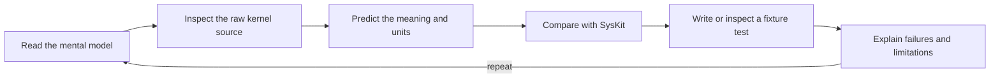
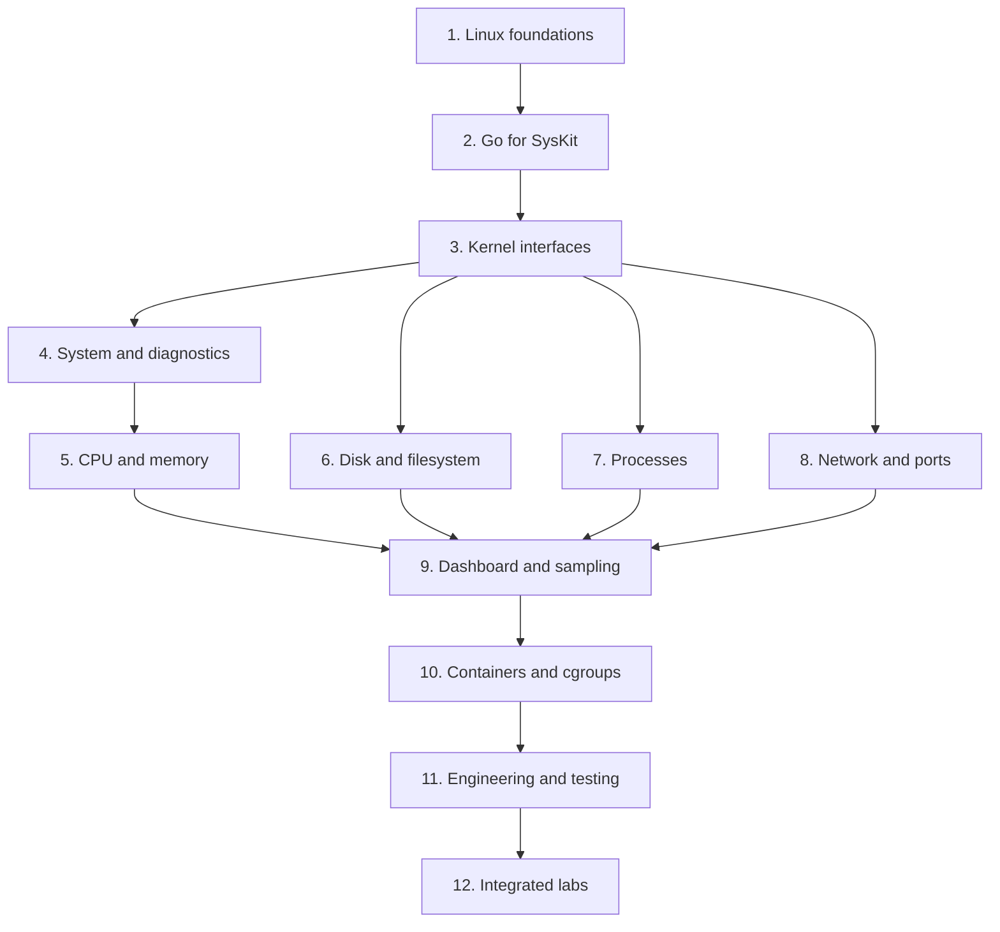
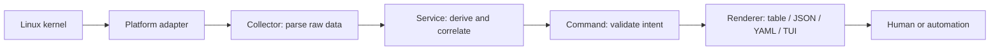

# SysKit Learning Center

> A practical, project-based course in Linux observability, Go systems
> programming, and the engineering decisions behind SysKit.

The `learning/` directory is not a second copy of the product documentation.
Specifications define **what SysKit must do**; these lessons teach **why Linux
behaves that way, how to investigate it, and how to prove an implementation is
correct**.

## Who This Is For

This course is designed for a reader who knows basic terminal usage and can read
simple Go, but has not yet built a Linux inspection tool. Experienced readers
can use the [competency matrix](#competency-matrix) to skip familiar material.

By the end, you should be able to:

- explain the difference between a counter, gauge, rate, ratio, and estimate;
- read procfs, sysfs, Netlink, and cgroup data without shelling out;
- trace one value from the kernel interface to SysKit's rendered output;
- write defensive parsers for unstable, optional, and permission-limited data;
- derive rates from timestamped snapshots without inventing precision;
- test collectors with fixtures and validate them against a live Linux host;
- diagnose CPU, memory, storage, process, network, and container symptoms;
- build deterministic CLI and terminal interfaces over the same service layer.

## How To Use The Course

Each lesson follows the same learning loop:



Do not run unfamiliar commands as root merely to make an example work. The
course deliberately includes missing files and permission failures because a
reliable inspection tool must handle both honestly. Commands labeled
**verification only** are for a human learner; production collectors still read
native kernel interfaces directly.

## Curriculum Map



| Stage | Lesson | Primary outcome | Suggested time |
|---:|---|---|---:|
| 1 | [Linux foundations](linux-foundations.md) | Navigate Linux resource models and units | 2–3 h |
| 2 | [Go for SysKit](go-systems.md) | Read and test the project's Go patterns | 3–4 h |
| 3 | [Kernel interfaces](kernel-interfaces.md) | Choose procfs, sysfs, Netlink, or cgroups correctly | 3–4 h |
| 4 | [system and diagnostics](system-diagnostics.md) | Interpret host identity/load and explain findings | 2–3 h |
| 5 | [CPU](cpu.md) + [memory](memory.md) | Derive utilization and interpret pressure | 4–6 h |
| 6 | [disk](disk.md) + [filesystem](filesystem.md) | Separate devices, filesystems, mounts, and rates | 4–6 h |
| 7 | [processes](process.md) | Parse `/proc/[pid]` safely under races | 3–5 h |
| 8 | [network](network.md) | Inspect interfaces, sockets, routes, and ownership | 4–6 h |
| 9 | [dashboard and watch](dashboard.md) | Build stable live views from sampled data | 3–4 h |
| 10 | [containers and plugins](containers.md) | Reason about cgroups and trust boundaries | 3–5 h |
| 11 | [engineering SysKit](engineering.md) | Apply architecture, tests, contracts, and profiling | 4–6 h |
| 12 | [integrated labs](labs.md) | Prove end-to-end operational competence | 6–10 h |

The times are guidance, not deadlines. A stage is complete when its checkpoint
is demonstrable, not when the document has been scrolled to the end.

## The SysKit Data Path

Every domain lesson should be read through this pipeline:



| Layer | Question to ask while learning | Example |
|---|---|---|
| Kernel interface | What does the source actually promise? | `/proc/stat` exposes cumulative ticks |
| Platform | Can the source be replaced by fixtures? | `SysFS.ReadFile("proc/stat")` |
| Collector | Are parsing and units truthful? | ticks stay raw counters |
| Service | Which values require time or correlation? | two snapshots become CPU utilization |
| Command | Is user input valid and predictable? | validate `--sort` and `--limit` |
| Renderer | Is the output deterministic and contract-safe? | JSON fields and types remain stable |

The canonical architecture is [`ARCHITECTURE.md`](../ARCHITECTURE.md). Learning
material explains it but does not redefine it.

## Competency Matrix

Use the levels consistently:

- **Recognize** — identify the source and vocabulary.
- **Explain** — describe semantics, units, and limitations without notes.
- **Apply** — collect and calculate the value correctly.
- **Diagnose** — distinguish similar symptoms and prove a conclusion.
- **Engineer** — implement, test, benchmark, and document the behavior.

| Domain | Recognize | Explain | Apply | Diagnose | Engineer |
|---|:---:|:---:|:---:|:---:|:---:|
| CPU and sampling | □ | □ | □ | □ | □ |
| Memory and PSI | □ | □ | □ | □ | □ |
| Block I/O and filesystems | □ | □ | □ | □ | □ |
| Processes and permissions | □ | □ | □ | □ | □ |
| Networking and sockets | □ | □ | □ | □ | □ |
| cgroups and containers | □ | □ | □ | □ | □ |
| Go and architecture | □ | □ | □ | □ | □ |
| Testing and performance | □ | □ | □ | □ | □ |

Record evidence, not confidence: a command transcript, diagram, fixture, test,
or written explanation. The detailed completion gates are in
[checklists.md](checklists.md).

## Safe Lab Environment

| Requirement | Minimum | Helpful |
|---|---|---|
| OS | Linux with readable `/proc` and `/sys` | VM or disposable development host |
| Go | Version declared in `go.mod` | `gopls`, `goimports`, `govulncheck` |
| Tools | `bash`, `git`, `make` | `strace`, `perf`, `iproute2`, `sysstat` |
| Access | Unprivileged shell | `sudo` only for explicitly marked observations |
| Project | A clean SysKit checkout | A second terminal for live sampling |

Before a session:

```bash
go version
uname -a
go run ./cmd/syskit version
go test ./...
```

Never paste sensitive `/proc/<pid>/environ`, command lines, addresses, hostnames,
or container metadata into fixtures without sanitizing them. Every captured
fixture needs provenance, but not secrets.

## Reading Conventions

| Marker | Meaning |
|---|---|
| **Kernel source** | Stable or documented Linux interface used by SysKit |
| **Verification only** | Existing utility used to cross-check, never called by a collector |
| **Unavailable** | Data does not exist or cannot be read; it is not numeric zero |
| **Snapshot** | Values observed at one point in time |
| **Rate** | Change in a counter divided by real elapsed time |
| **Checkpoint** | Evidence required before moving to the next stage |

Shell examples use `$` for an unprivileged prompt. Do not include the prompt
when copying a command. Output is illustrative; live system values will differ.

## Canonical Sources And Boundaries

### Product Coverage

| Implemented feature | Primary lesson | Supporting lesson |
|---|---|---|
| System | [System and diagnostics](system-diagnostics.md) | [Linux foundations](linux-foundations.md) |
| CPU | [CPU](cpu.md) | [Engineering](engineering.md) |
| Memory | [Memory](memory.md) | [Containers](containers.md) |
| Disk | [Disk](disk.md) | [Filesystem](filesystem.md) |
| Filesystem | [Filesystem](filesystem.md) | [Disk](disk.md) |
| Process | [Processes](process.md) | [Containers](containers.md) |
| Network | [Networking](network.md) | [Kernel interfaces](kernel-interfaces.md) |
| Ports | [Networking](network.md) | [Processes](process.md) |
| Diagnostics | [System and diagnostics](system-diagnostics.md) | All domain lessons |
| Dashboard, top, watch | [Live monitoring](dashboard.md) | [Go for SysKit](go-systems.md) |
| Interactive menu | [Live monitoring](dashboard.md) | [Engineering](engineering.md) |
| Containers | [Containers and cgroups](containers.md) | [Kernel interfaces](kernel-interfaces.md) |
| Plugins | [Plugin boundaries](containers.md) | [Engineering](engineering.md) |
| Table, JSON, YAML | [Engineering: output](engineering.md#8-output-and-compatibility) | [Go for SysKit](go-systems.md) |

Every feature in [`specs/features/`](../specs/features/README.md) has an explicit
learning route. The feature specification remains the behavior contract.

### Source Of Truth

- Feature behavior: [`specs/features/`](../specs/features/README.md)
- Architecture: [`ARCHITECTURE.md`](../ARCHITECTURE.md)
- Collector rules: [`specs/collectors.md`](../specs/collectors.md)
- CLI behavior: [`specs/cli-conventions.md`](../specs/cli-conventions.md)
- Testing requirements: [`specs/testing-strategy.md`](../specs/testing-strategy.md)
- Terms: [`docs/glossary.md`](../docs/glossary.md)
- Completion criteria: [`standards/definition-of-done.md`](../standards/definition-of-done.md)

If a lesson conflicts with one of those sources, the canonical source wins and
the lesson must be corrected. Start with the full [roadmap](roadmap.md), then use
the [labs](labs.md) to turn knowledge into evidence.
