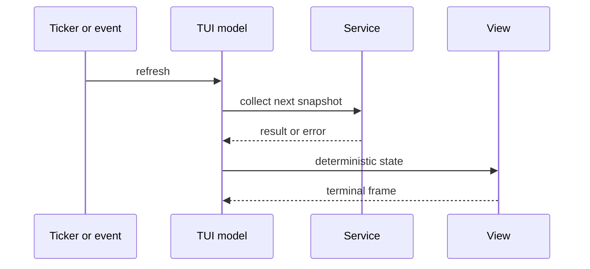

# Live Monitoring: Dashboard, Top, And Watch

> Study notes on live terminal UIs, sampling cadence, and the stream/rendering
> discipline SysKit's interactive modes depend on.
> Written to prepare you for the v0.3 Real-Time Monitoring work: `syskit
> dashboard`, `syskit watch <command>`, and `syskit top`. Read the dashboard
> feature spec (`specs/features/dashboard.md`), the rendering architecture
> (`specs/rendering.md`), the logging strategy (`specs/logging-strategy.md`), and
> ADR 006 (`decisions/006-bubbletea-for-tui.md`) alongside this. The two-sample
> delta model taught in `cpu.md` and `disk.md` is a hard prerequisite — a
> dashboard is that model on a loop, on a screen.

---

| Attribute | Value |
|---|---|
| Level | Engineering/domain integration |
| Prerequisites | [CPU](cpu.md), [disk](disk.md), [Go for SysKit](go-systems.md) |
| Time | 3–4 hours |
| Product contract | [Dashboard feature](../specs/features/dashboard.md) |

## Learning Objectives

- Model live views as repeated service snapshots, not new collectors.
- Use real elapsed time and monotonic timestamps across refresh jitter.
- Separate update state, commands, rendering, and terminal side effects.
- Handle resize, small terminals, cancellation, errors, and backpressure.
- Preserve stdout/stderr, no-color, and non-TTY behavior.



## Concepts

A dashboard is not a new kind of data. It is the *same* snapshots the one-shot
commands produce, sampled repeatedly and painted onto a terminal that can change
size and receive keystrokes underneath you. Almost every dashboard bug comes from
forgetting one of those three facts — that the data is a rate between two
samples, that the screen is a shared resource with strict stream rules, or that
the terminal's geometry is not fixed. Four ideas carry the whole chapter.

**1. A live view is a loop over the two-sample model.** In `cpu.md` you learned
that utilization is a *derivative*: read `/proc/stat` at T1, wait, read at T2,
divide the deltas. A dashboard just does this forever: sample, render, sleep,
sample, render. The refresh interval (default `1s`, per
`specs/configuration.md`'s `refresh_interval`) is the nominal gap between
samples. The subtle, load-bearing fact: the *actual* elapsed time between two
samples is never exactly the interval, so your rate math must divide by the
**real measured delta**, not the nominal interval. This is "sampling intervals
and jitter," covered in full below.

**2. The screen and the data stream are governed by strict rules.** SysKit's
logging strategy is absolute: **machine-readable data on stdout, diagnostics on
stderr, never mixed.** In a TUI this rule does not relax — it gets sharper,
because the terminal UI now *owns* the screen via the alternate screen buffer,
and a stray log write can literally corrupt the frame the user is looking at.

**3. The terminal has no fixed size.** A user drags a window, splits a tmux pane,
or reattaches over SSH, and the terminal's width and height change out from under
you. The kernel signals this with **SIGWINCH**; Bubble Tea turns it into a
**`tea.WindowSizeMsg`** delivered into your `Update` loop. Caching the size once
at startup is the classic newcomer mistake.

**4. Collection and rendering are separate, and reuse the existing services.**
The dashboard is a *second presentation over shared logic*, not a parallel data
path. The TUI renderer never reads `/proc`, `/sys`, Netlink, or cgroups — only
the platform layer does. This is what keeps the Bubble Tea `Update` function pure
and unit-testable, and it is a direct consequence of ADR 004's strict
downward-dependency rule.

Keep these four straight and the rest is detail.

---

## Linux Internals

### Sampling intervals and jitter (the core timing lesson)

You configure a **fixed refresh interval** — say `1s`. It is tempting to picture
a metronome: a sample exactly every 1000ms, forever. Reality is messier, and the
gap between the intended interval and what actually happens is called **jitter**.

Why the *actual* elapsed time between two samples drifts from the nominal
interval:

- **Scheduler delay.** Your timer fires a "tick" message, but the OS scheduler
  decides when your goroutine actually runs. On a busy box you may be woken tens
  of milliseconds late. `time.Sleep`/timers guarantee *at least* the requested
  duration, never *exactly* it.
- **Collection cost.** Reading and parsing `/proc/stat`, `/proc/meminfo`,
  mountinfo, and Netlink is not free. If a sample cycle takes 40ms of work, the
  next tick effectively starts later. The heavier the panels, the more the real
  cadence sags below the nominal one.
- **Coalescing under load.** If the machine is saturated (the very moment a user
  opens a dashboard), ticks can bunch up or be delivered late in a clump.

Here is the mistake that produces *wrong numbers on screen*: computing a rate by
dividing the counter delta by the **nominal** interval. Suppose a NIC's byte
counter grew by 12,000,000 bytes and you assumed exactly 1s elapsed, so you print
12 MB/s. But the real gap was 1.25s — the true rate was 9.6 MB/s. You just
overstated throughput by 30% because you trusted the clock you *asked* for
instead of the clock that *happened*.

**The rule, stated once and for all: divide by the real measured delta, not the
nominal interval.** This is exactly why `cpu.md` insists you "keep the timestamp
with each snapshot — you need the real elapsed time, not the intended interval,
if the process was delayed." Every live rate in the dashboard — CPU%, disk IOPS,
network throughput — is `Δcounter / Δt_measured`, where `Δt_measured` comes from
timestamps you captured at each read, not from the interval you configured. The
nominal interval controls *how often you sample*; the measured delta controls
*what the rate is*.

Two related guardrails from the spec:

- **Bound the interval.** The acceptance criteria require the refresh interval be
  bounded "to avoid excessive system overhead." A user asking for `--interval
  1ms` would spin the CPU sampling faster than it can collect, so clamp to a sane
  floor.
- **When collection outlasts the interval,** you do not queue up a backlog of
  stale samples — you skip and resample. See the backpressure note below.

### Stdout data vs. stderr diagnostics — and how the TUI changes the picture

SysKit's hardest output rule (`specs/logging-strategy.md`): **data → stdout,
diagnostics/logs/errors → stderr, never mixed.** The payoff is composability —
`syskit cpu --format json | jq` must receive clean JSON on stdout, with any
warning routed to stderr where it cannot corrupt the machine-readable stream. The
logger is built once at the CLI layer, always writes to `os.Stderr`, and there is
*no code path* where it writes to stdout. Lower layers (collectors, services,
platform) never log at all — they return errors and let the CLI decide.

Now the twist that trips people up in TUI mode. A Bubble Tea program takes over
the terminal using the **alternate screen buffer** — the same mechanism `vim`,
`less`, and `htop` use: it switches to a separate full-screen buffer, draws
there, and restores your original scrollback untouched on exit. Bubble Tea's
`View` function returns the *entire* frame as a string and the runtime paints it.
The renderer owns every cell on that screen.

So what happens if some library code does a stray `fmt.Println` or a `slog` call
that lands on the same terminal while the dashboard is running? It writes control
characters and text into the middle of the frame Bubble Tea is managing — **a
corrupted, garbled screen.** The stream-separation rule is now doing double duty:
it protects pipelines *and* it protects the rendered frame.

The consequences for the dashboard:

- Diagnostics must **still** go to stderr or, better, to a **log file** while the
  TUI runs — never interleaved into the screen Bubble Tea owns. A common, correct
  pattern (Bubble Tea documents this) is to redirect logging to a file for the
  duration of the program, precisely because stderr may also be attached to the
  same terminal.
- Collection errors are *not* logged into the frame; they are turned into
  **model state** and rendered as a panel/status message by `View` (spec: "Data
  collection errors are displayed without killing the session unless fatal"). The
  error becomes data-for-the-view, not a log line.
- Because the TUI is interactive, it must **refuse or degrade gracefully when
  stdout is not a TTY** (spec acceptance criterion + edge case "user pipes
  dashboard output to a non-TTY"). Painting an alternate-screen UI into a pipe
  produces garbage; detect the non-TTY and either error out cleanly or fall back
  to a plain snapshot.

Newcomer mistake: "it's just a debug print, it'll go to the console." In a
full-screen TUI there *is* no free console — the console is the canvas. Route
diagnostics off-screen.

### Terminal resize events — SIGWINCH and WindowSizeMsg

A terminal's size is dynamic. When the user resizes the window, splits a pane, or
a reattached SSH session renegotiates dimensions, the kernel sends the foreground
process group **SIGWINCH** ("window change"). The program is expected to query
the new size (classically via the `TIOCGWINSZ` ioctl) and re-lay-out.

You will not wire up `SIGWINCH` by hand — Bubble Tea does it for you and delivers
the change as a message into the Elm loop. On startup and on every resize, your
`Update` function receives a **`tea.WindowSizeMsg`** carrying `Width` and
`Height`. The correct pattern:

```go
func (m Model) Update(msg tea.Msg) (tea.Model, tea.Cmd) {
    switch msg := msg.(type) {
    case tea.WindowSizeMsg:
        m.width = msg.Width      // store it in the model...
        m.height = msg.Height    // ...and re-layout on every one, not just the first
        return m, nil
    // ...
    }
}
```

**The newcomer mistake: caching width/height once at startup** (e.g. reading the
size in your program's `Init` or `main` and never listening for the message).
The first `WindowSizeMsg` looks like it's enough — the layout is correct on
launch — but the moment the user resizes, panels overflow, wrap, or overlap
because you never updated the stored dimensions. The rule: **treat size as
model state that every `WindowSizeMsg` updates,** and let `View` re-compute the
layout from the *current* width/height each frame.

Graceful handling of **very small terminals** is a first-class requirement, not
an afterthought (spec edge case "terminal is too small for all panels";
acceptance criterion "resize does not panic or overlap panels"). When the
available width or height cannot fit all panels:

- **Truncate visibly** rather than overflowing — cut a line and mark it (an
  ellipsis or a `…`), the same "truncate only when necessary and visibly"
  contract the table renderer follows in `specs/rendering.md`.
- **Never index past the buffer.** A panel that assumes at least N columns will
  panic or draw garbage in a 20-column terminal; clamp every layout computation
  to the real size.
- Consider **dropping or collapsing panels** below a threshold (show CPU + memory
  only, hide the rest) instead of drawing an unreadable mess.

Resize handling and layout are owned entirely by the TUI renderer
(`specs/rendering.md`: the TUI owns "Layout … Refresh timing … Resize handling").
The collectors know nothing about terminal geometry.

### Keeping collection and rendering separated

This is the architectural heart of the chapter, and it is the same
strict-downward-dependency rule from every other collector, applied to a live UI.

**The dashboard reuses the same service layer as the non-interactive commands.**
There is no second copy of the collection logic, no duplicate parsing "optimized
for the TUI." When a panel needs CPU utilization, it calls the *same* CPU service
that `syskit cpu` calls; the service runs the collector, subtracts two snapshots,
and returns typed model structs. The dashboard spec makes this an acceptance
criterion: "Services used by dashboard are the same services used by static
commands." ADR 006 says it plainly: Bubble Tea "models call the existing service
layer for data and hold no data-collection logic."

**The TUI renderer never reads kernel interfaces directly.** It must not touch
`/proc`, `/sys`, Netlink, or cgroups — only the platform layer does that
(`specs/rendering.md`; ARCHITECTURE.md §4). Data flows *down then up* through the
layers: CLI/TUI → service → collector → platform → kernel, and the results flow
back. The renderer sits at the very top and consumes structured data; it never
reaches around the stack to read a file itself.

Why this discipline pays off — the part worth internalizing:

- **It makes the `Update` function pure, and therefore unit-testable.** In the
  Elm architecture (ADR 006), application state is a `Model`, events are handled
  by a pure `Update` function returning the next model plus commands, and `View`
  renders the model to a string. "Pure" means `Update` has no side effects: it
  does not read files, does not sleep, does not talk to the kernel. It takes
  `(model, message)` and returns `(model, command)`. That is what lets you drive
  it in a test with a synthetic `WindowSizeMsg` or a synthetic "new CPU sample"
  message and assert the resulting model **without a real terminal and without a
  real `/proc`.** The moment `Update` reads `/proc/stat` itself, it stops being
  pure, stops being testable, and duplicates logic the service already owns.
- **The actual I/O lives in commands.** Bubble Tea's escape hatch for side
  effects is a `tea.Cmd` — a function run *outside* `Update` that performs work
  (call the service, wait for the tick) and feeds its result back as a message.
  Sampling happens in a command; `Update` only folds the resulting data into the
  model. Collection and rendering stay cleanly on opposite sides of that seam.
- **One source of truth.** A number shown in the dashboard and the same number
  from `syskit cpu --format json` come from identical code, so they cannot
  disagree — no "the TUI says 40% but the JSON says 55%" bugs.

Newcomer mistake: "it'll be faster/simpler if the widget just reads `/proc`
itself." It is neither. You lose testability, you fork the parsing logic, and you
break the layering that lets the same fix serve every presentation at once.

### Different cadences and backpressure (foreshadowing RT-01/WCH-01)

Collection and rendering run on **different cadences and must not block each
other.** Two failure modes to hold in your head:

- **A slow collector must not freeze the UI.** If a sample cycle stalls (a
  sluggish Netlink query, a huge process table), the screen must keep responding
  to keystrokes and resizes. That is why sampling runs as a `tea.Cmd` off the
  `Update` loop, not inline — `Update` stays responsive while the command does
  the slow work in the background and returns a message when done.
- **A slow render must not stall sampling** — and, conversely, you must not let
  samples pile up. If collection takes *longer* than the refresh interval (a spec
  edge case), the answer is **backpressure**: skip the missed ticks and resample
  fresh, rather than queueing a backlog of stale snapshots that would render the
  past. A live view should always show *now*, dropping intermediate frames under
  load, not replaying a lag.

This is the intuition behind the backlog item **RT-01** (real-time refresh
pipeline: "concurrent, race-safe, backpressure") and **WCH-01** (`syskit watch`).
It also connects to ADR-008: live modes hold only a **per-session, in-memory
previous snapshot** — just enough to compute the next delta — and nothing more.
No history buffer, no persistence, no queue. One previous snapshot in memory, one
current sample, one delta. That is the whole state a live rate needs.

Keep that state per session and in memory, and remember it is discarded when the
session ends — there is no datastore behind the dashboard.

### Keyboard interaction and clean exit

The TUI renderer also owns **keyboard navigation and focus state**
(`specs/rendering.md`). Conceptually this is more Elm loop: a key press arrives
as a `tea.KeyMsg` in `Update`, which mutates model state (move focus to the next
panel, change the process sort key, toggle a view) and lets `View` redraw. No
key handling leaks into the collectors — it is pure presentation state.

Two things every interactive SysKit view must get right:

- **Quit handling.** A recognized quit key (conventionally `q` or `ctrl+c`)
  produces `tea.Quit` from `Update`, which tells the Bubble Tea runtime to stop
  the event loop.
- **Clean teardown.** On quit, the runtime **leaves the alternate screen buffer**
  and restores the terminal to the exact state it was in before launch — original
  scrollback intact, cursor visible, echo restored (spec: "Exit cleanly without
  corrupting terminal state"). If a program crashes without restoring the
  terminal, the user is left in a broken shell (no echo, stuck alternate buffer).
  Bubble Tea handles the restore for you as long as you exit through its lifecycle
  rather than calling `os.Exit` out from under it.

Related edge case: an **SSH disconnect** tears down the TTY mid-session. The
program should notice the closed terminal and exit rather than spin forever
rendering into a dead file descriptor.

---

## Important Files And Signals

Unlike the data collectors, the dashboard's "sources" are mostly kernel
*mechanisms* (signals, the TTY) rather than files you parse — the *metrics* still
come from the same `/proc`, `/sys`, and Netlink sources the other chapters cover,
read through the service layer.

| Thing | What it is | Why it matters here |
|------|------------|---------------------|
| `SIGWINCH` | Signal sent to the foreground process group on terminal resize | The kernel's "the window changed" notification; Bubble Tea consumes it and emits `tea.WindowSizeMsg`. |
| `TIOCGWINSZ` (ioctl) | Query current terminal rows/cols | How size is actually read after a `SIGWINCH`; handled for you by the TUI framework. |
| `os.Stdout` | The data stream | Machine-readable output only; the alternate-screen frame is drawn here for a real TTY, and it must be a TTY. |
| `os.Stderr` | The diagnostics stream | Where logs/errors go — never mixed with data, never into the frame. Prefer a log file while the TUI owns the screen. |
| Alternate screen buffer | A secondary full-screen terminal buffer | Bubble Tea draws the dashboard here and restores original scrollback on exit. |
| `isatty` / TTY check | Is stdout a terminal? | Gate the interactive UI; refuse or degrade to a snapshot when piped to a non-TTY. |
| Per-session previous snapshot | One in-memory prior sample (ADR-008) | The only state a live rate needs: `Δcounter / Δt_measured`. No history, no persistence. |
| `refresh_interval` (config) | Duration, default `1s` | The *nominal* sampling cadence; bounded to a floor to cap overhead. Never used as the rate denominator. |

---

## Useful Commands

These are for **you**, to build intuition for terminals, signals, and cadence —
SysKit does not shell out to any of them.

| Command | Use |
|---------|-----|
| `stty size` | Print the current terminal rows and columns — the value a `WindowSizeMsg` carries. Resize your window and re-run to watch it change. |
| `tput lines` / `tput cols` | Same dimensions via terminfo; another way to see live geometry. |
| `htop` / `top` | Reference live dashboards. Resize the window while they run to watch graceful re-layout; press `q` to see clean teardown restore your scrollback. |
| `watch -n1 'grep cpu /proc/stat'` | The two-sample loop by hand — the raw counter climbing once a second is the model the dashboard automates. |
| `kill -WINCH <pid>` | Manually send `SIGWINCH` to a process to see how it reacts to a resize event. |
| `syskit cpu --format json \| jq .` | Prove the stream-separation contract: clean JSON on stdout, diagnostics (if any) on stderr. Break it and `jq` chokes. |
| `time syskit disk` | Feel collection cost — the work that eats into your refresh interval and creates jitter. |
| `script` / `tmux` | Reproduce resize and reattach scenarios (including the SSH-disconnect-style teardown) in a controlled way. |

Handy check for the jitter lesson: log the *measured* delta between two samples
in a tight loop under load (`stress-ng` in another pane) and watch it wander above
the nominal interval — that wander is exactly why you divide by the measured
delta, not the configured one.

---

## References

- Dashboard feature spec: `../specs/features/dashboard.md`
- Rendering architecture (TUI ownership, no direct `/proc` reads):
  `../specs/rendering.md`
- Logging strategy (stdout=data, stderr=diagnostics, never mixed):
  `../specs/logging-strategy.md`
- Configuration (`refresh_interval` default `1s`): `../specs/configuration.md`
- ADR 006 — Bubble Tea + Lip Gloss for the TUI (Elm architecture, pure testable
  `Update`): `../decisions/006-bubbletea-for-tui.md`
- ADR-008 — No persistent storage; only a per-session in-memory previous
  snapshot: `../decisions/008-no-persistent-storage.md`
- ARCHITECTURE.md §4 (Components & Responsibilities) and §7 (Concurrency,
  backpressure): `../ARCHITECTURE.md`
- Backlog RT-01 (real-time refresh pipeline) / WCH-01 (`syskit watch`):
  `../plan/product-backlog.md`
- Bubble Tea and The Elm Architecture: https://github.com/charmbracelet/bubbletea
  — https://guide.elm-lang.org/architecture/
- `signal(7)` (incl. `SIGWINCH`): https://man7.org/linux/man-pages/man7/signal.7.html
- `tty_ioctl(4)` (`TIOCGWINSZ` window size): https://man7.org/linux/man-pages/man4/tty_ioctl.4.html
- `console_codes(4)` (alternate screen buffer / terminal control):
  https://man7.org/linux/man-pages/man4/console_codes.4.html

---

## Practical Lab

Run `syskit dashboard`, `syskit top`, and one `syskit watch` command. Resize to
narrow/wide dimensions, interrupt during loading, test no-color behavior, and
redirect a non-interactive invocation. Map each observation to an event/state
transition and a test.

## Failure-Mode Matrix

| Case | Correct behavior |
|---|---|
| refresh takes longer than interval | Bound work; avoid unbounded queued refreshes |
| terminal becomes tiny or zero-sized | Stable compact/empty layout without panic |
| service returns partial data | Render identified partial state; keep loop responsive |
| context cancelled | Stop ticker/work and restore terminal cleanly |
| stdout is redirected | No control sequences or interactive menu |
| color disabled | Icons/text/layout still convey meaning |

## Checkpoint

Draw the live state machine, explain ownership of collection versus rendering,
and show test evidence for resize, cancellation, errors, and slow refresh.
