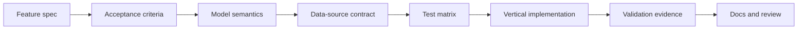
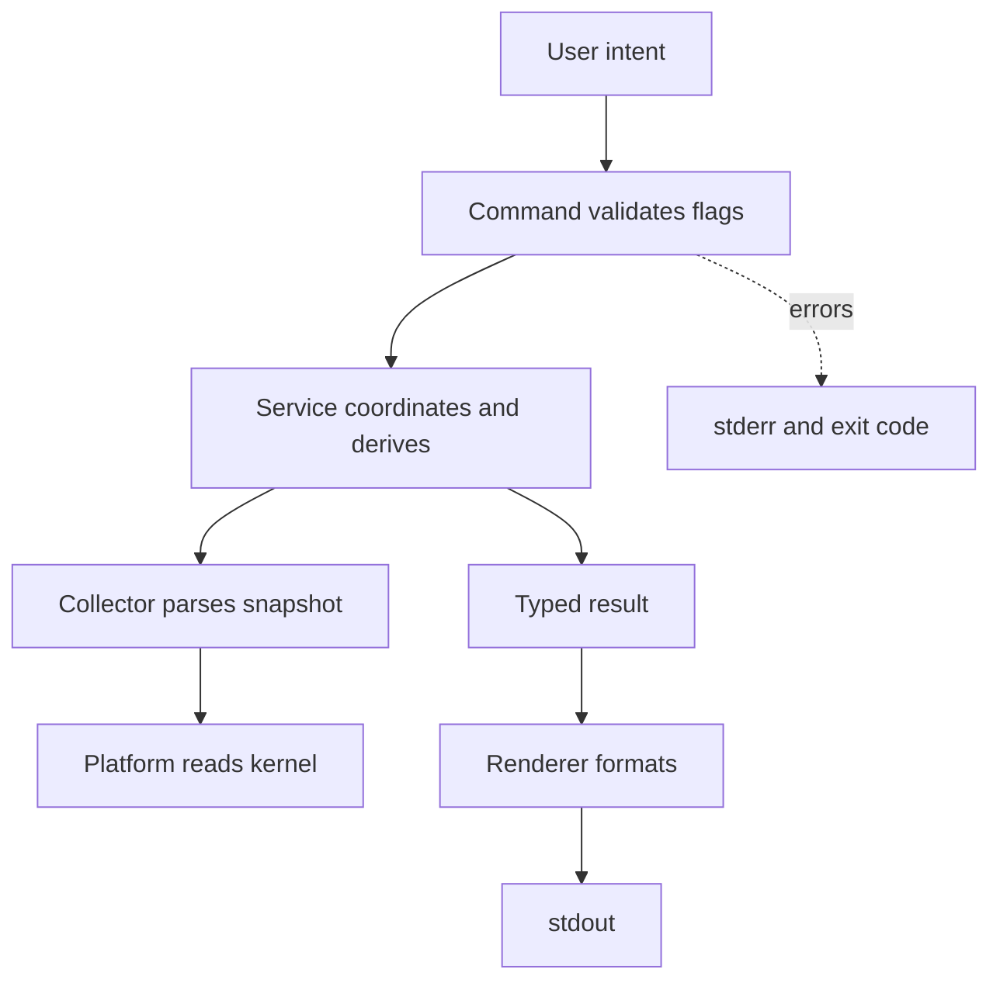
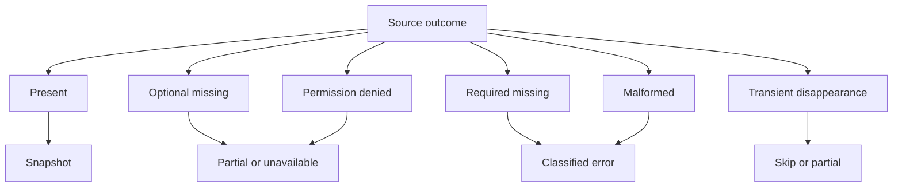
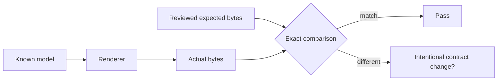
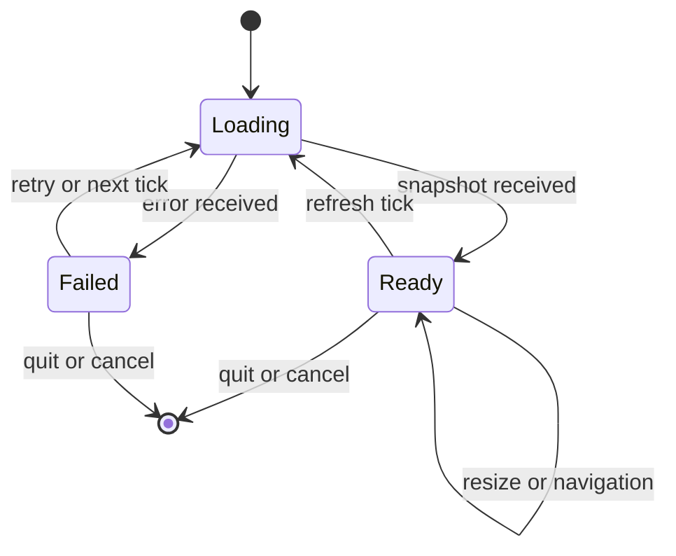

# Engineering A SysKit Feature

> Turn Linux knowledge into a small, testable, contract-safe vertical slice.

| Attribute | Value |
|---|---|
| Level | Intermediate |
| Prerequisites | Foundation and at least one domain lesson |
| Time | 4–6 hours plus feature review |
| Outcome | Evaluate or implement a feature against every quality boundary |

## Learning Objectives

After this lesson, you can:

- convert a feature spec into source, model, and test contracts;
- place responsibilities in the correct SysKit layer;
- design partial-data and error behavior before code;
- create deterministic unit, fixture, integration, golden, and race tests;
- benchmark and profile hot paths without weakening correctness;
- keep CLI, structured output, TUI, docs, and compatibility aligned.

## 1. Specification To Evidence



For each acceptance criterion, name observable evidence. A vague statement that
the feature works is not evidence; a parser test, integration invariant, golden
output, benchmark, or reproducible command is.

| Requirement | Evidence example |
|---|---|
| Missing PSI is unavailable | Fixture without file plus model/JSON assertion |
| CPU usage uses two samples | Service test with known counter deltas |
| No shell command used | Imports/code review plus fixture collector test |
| JSON remains stable | Golden and contract test |
| Permission is partial | Fake permission error plus exit/output assertion |
| Live loop exits cleanly | Context/key event test plus race-aware review |

## 2. Vertical Slice Ownership



| Decision | Owner |
|---|---|
| Path/socket mechanics | Platform |
| Raw field parsing | Collector |
| Rate, filter, sort, joins | Service |
| Flag validation | Command |
| Table/JSON/YAML shape | Renderer/model contract |
| Error presentation and exit | CLI |
| Refresh/key/resize state | CLI/TUI over services |

Architecture smells include a collector returning a formatted size, a renderer
reading `/proc`, a command subtracting counters, a platform adapter knowing CLI
flags, a service printing warnings, or a TUI duplicating collection logic.

## 3. Model And Error Design First

Write a field contract before a struct:

| Field | Source | Type/unit | Optional? | Derived? | Reset/scope notes |
|---|---|---|:---:|:---:|---|
|  |  |  |  |  |  |

Then enumerate source outcomes:



Define whether each class terminates the domain, yields partial data, or skips
one entity. Match the feature spec and canonical error contract.

## 4. Test Matrix

| Layer | Happy path | Boundary | Failure | Contract |
|---|---|---|---|---|
| Parser | Representative bytes | min/max/extra fields | malformed/truncated | exact typed value |
| Collector | Full fixture | missing optional | read/permission errors | source context |
| Service | Known snapshots | zero elapsed/reset/filter limits | partial collector | derived semantics |
| Command | Valid flags | empty/list limits | invalid args | exit/error class |
| Renderer | Normal model | empty/unavailable/wide text | writer failure | golden shape |
| Integration | Live invariant | optional capability | permission where safe | no host constants |
| TUI/live | refresh/event | resize/small terminal | cancellation/error | stable cleanup |

Fixture principles:

- capture the minimum data needed for the scenario;
- retain exact whitespace and delimiters relevant to parsing;
- sanitize identities and secrets and document provenance;
- mutate cases explicitly rather than hiding them in setup;
- keep expected values visible in test tables.

### Golden Tests



Golden output is reviewed product behavior, not a shortcut. Update it only
after understanding every changed byte. Structured output changes can be
breaking even when Go compiles.

## 5. Derived Metrics

Rates use matched entities and actual elapsed time:

```text
rate = (counter_t2 - counter_t1) / (time_t2 - time_t1)
utilization = 100 * busy_delta / total_delta
```

Test known deltas, zero elapsed/total, counter reset, entity additions/removals,
jitter, arithmetic bounds, and unavailable raw fields. Do not clamp an unknown
math bug into a plausible range without understanding its cause.

## 6. Live Loops And TUI State



Test model transitions separately from terminal drawing. Rendering must handle
zero/narrow width, empty data, and unavailable fields. Color is never the only
carrier of meaning. One-shot and TUI actions use the same services.

## 7. Performance And Profiling

Follow this order:

1. Define correctness and a representative workload.
2. Write a benchmark with `b.ReportAllocs()`.
3. Run multiple samples on the same host.
4. Profile CPU/allocations if the benchmark identifies a problem.
5. Change one bottleneck.
6. Rerun correctness, race tests, and benchmark.
7. Document meaningful baseline changes.

| Tool | Question |
|---|---|
| `go test -bench . -benchmem` | Time and allocations per workload |
| `benchstat` | Is the before/after difference credible? |
| CPU profile | Where is execution time spent? |
| Heap/allocation profile | Where are allocations created or retained? |
| `go test -race` | Is shared memory accessed unsafely? |
| `go tool trace` | How do goroutines, blocking, and scheduling behave? |

Do not compare wall-clock benchmark numbers from unrelated hosts as if they were
a regression. Allocation counts are often more portable but still need context.

## 8. Output And Compatibility

| Surface | Stability concern |
|---|---|
| Table | Readability, widths, headers, `--no-header` |
| JSON | Field names, types, nullability, nesting |
| YAML | Must mirror JSON meaning |
| stdout | Data only for structured and piped use |
| stderr | Diagnostics and errors |
| Exit code | Script-visible outcome contract |
| TUI | Keyboard, mouse, resize, and no-color meaning |

When adding a field, decide whether it is always present, nullable, omitted, or
versioned. Default marshaling behavior is not a substitute for a contract.

## 9. Documentation Set

| Document | Update when |
|---|---|
| Feature spec | Requirements or acceptance criteria change |
| CLI reference/help | Command, flag, or output behavior changes |
| Learning lesson | Linux semantics, hazards, or understanding changes |
| Architecture/ADR | Boundary or dependency decision changes |
| Compatibility/schema docs | Stable public surface changes |
| Changelog | User-visible behavior changes |

Link to canonical explanations instead of duplicating them. Learning material
teaches reasoning but does not silently redefine product behavior.

## 10. Feature Review Worksheet

| Area | Evidence |
|---|---|
| Spec and acceptance criteria |  |
| Kernel sources and authority |  |
| Units and metric types |  |
| Optional/partial/error semantics |  |
| Layer ownership |  |
| Unit/fixture coverage |  |
| Integration invariants |  |
| Golden/contract coverage |  |
| Race/cancellation behavior |  |
| Benchmark/profile evidence |  |
| Docs and help alignment |  |
| Validation commands |  |

## Practical Review Lab

Pick an existing domain:

1. Map every acceptance criterion to a test or identify the gap.
2. Trace one model field to its kernel source and normalized unit.
3. Find how optionality appears in table and JSON output.
4. Identify one race or lifecycle transition and its test.
5. Run narrow package tests, then `go test -race ./...`.
6. Run a relevant benchmark and interpret allocations.
7. Complete the worksheet and compare it with the Definition of Done.

## Checkpoint

You have mastered this lesson when another contributor can use your worksheet to
reproduce a feature's source semantics, tests, output, limitations, and
validation without undocumented assumptions.

Next: [Integrated labs](labs.md).

## References

- [Canonical architecture](../ARCHITECTURE.md)
- [Testing strategy](../specs/testing-strategy.md)
- [CLI conventions](../specs/cli-conventions.md)
- [Definition of Done](../standards/definition-of-done.md)
- [Code review standard](../standards/code-review.md)
- [Performance baseline](../docs/performance.md)
