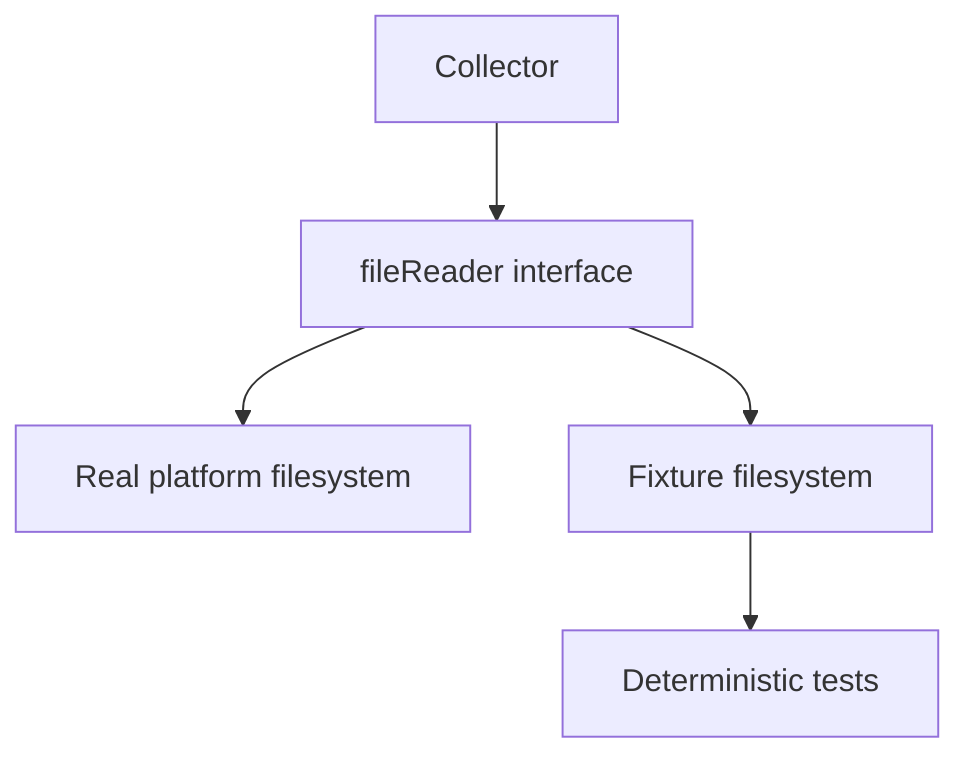
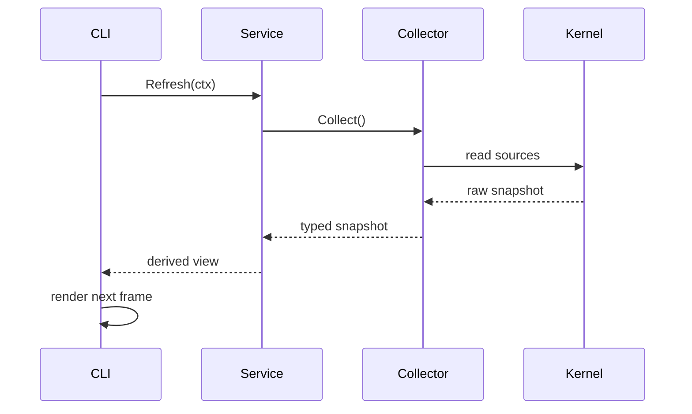
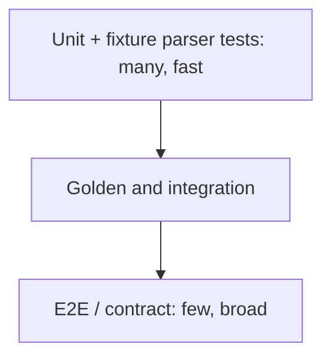

# Go For SysKit

> The Go concepts needed to read, test, and extend a Linux inspection CLI while
> preserving SysKit's architecture.

| Attribute | Value |
|---|---|
| Level | Foundation to intermediate |
| Prerequisites | [Linux foundations](linux-foundations.md), basic programming |
| Time | 3–4 hours plus code reading |
| Outcome | Trace and implement an idiomatic, tested vertical slice |

## Learning Objectives

After this lesson, you can:

- navigate modules, packages, commands, and `internal/` boundaries;
- model optional observations and base-unit values explicitly;
- parse pseudo-files with `io`, `bufio`, `strconv`, and defensive validation;
- define small consumer-owned interfaces and inject platform dependencies;
- classify and wrap errors while preserving `errors.Is` behavior;
- use contexts, goroutines, channels, and timers without leaks;
- write table-driven, fixture-backed, golden, race, and benchmark tests.

## 1. Toolchain And Module

Use the version declared by the repository rather than a version copied from a
tutorial:

```bash
go version
go env GOMOD
go env GOVERSION
go list ./...
```

| Command | Purpose |
|---|---|
| `go run ./cmd/syskit --help` | Build and execute without installing |
| `go build ./...` | Compile all packages |
| `go test ./...` | Run normal tests |
| `go test -race ./...` | Detect unsafe concurrent access |
| `go vet ./...` | Run standard static analysis |
| `go test -run TestName ./path` | Focus one test |
| `go test -bench . -benchmem ./path` | Measure time and allocations |
| `go doc package.Symbol` | Read package documentation locally |

Go package names describe what a package provides. SysKit avoids grab-bags such
as `util`, `helpers`, and `common` because they erase ownership and invite layer
violations.

## 2. Repository Boundaries

```mermaid
flowchart LR
    Main[cmd/syskit] --> CLI[internal/cli]
    CLI --> Command[internal/cli/command]
    Command --> Service[internal/service]
    Service --> Collector[internal/collector/domain]
    Collector --> Platform[internal/platform]
    Platform --> Kernel[/proc /sys Netlink cgroups]
    Collector --> Model[internal/model]
    Service --> Model
    CLI --> Render[internal/render]
    Render --> Model
```

| Package area | Owns | Does not own |
|---|---|---|
| `cmd/syskit` | Process entry point | Domain behavior |
| `internal/cli` | Root wiring, config, exit mapping, TUI | Kernel parsing |
| `internal/cli/command` | Flags and command intent | Derived metrics |
| `internal/service` | Correlation, filtering, rates | Rendering or file reads |
| `internal/collector` | Raw parsing into typed snapshots | CLI or display decisions |
| `internal/platform` | OS interaction seam | User intent |
| `internal/model` | Shared domain values | I/O behavior |
| `internal/render` | Deterministic presentation | Collection |

The `internal` rule is enforced by the Go tool: code outside the parent module
tree cannot import these packages. The stricter layer direction is a project
rule and must be visible in imports and review.

## 3. Model The Meaning, Not Just The Number

A `uint64` cannot say whether the value is present. Use a representation whose
zero value and serialization semantics are intentional. Existing SysKit models
are canonical; inspect them before introducing a new pattern.

```go
type OptionalUint64 struct {
    Value     uint64
    Available bool
}
```

| Design question | Good default |
|---|---|
| Raw or display unit? | Store exact base units/counters |
| Pointer or `(value, ok)`? | Follow existing domain model and serializer contract |
| Can zero be real? | Never use zero as the missing sentinel |
| Counter or derived rate? | Preserve raw counter; derive in service |
| Timestamp needed? | Attach observation time to snapshots |
| JSON field stability? | Treat names/types as a public compatibility contract |

Avoid encoding display strings such as `"1.2 GiB"` in collector models. That
destroys precision, prevents sorting, and couples collection to presentation.

## 4. Parsing Kernel Text

A safe parser separates reading from interpretation and validates the ABI it
depends on.

```go
func parseUintField(raw []byte) (uint64, error) {
    text := strings.TrimSpace(string(raw))
    if text == "" {
        return 0, fmt.Errorf("parse value: empty input")
    }

    value, err := strconv.ParseUint(text, 10, 64)
    if err != nil {
        return 0, fmt.Errorf("parse value %q: %w", text, err)
    }
    return value, nil
}
```

### Parsing Checklist

- Define the delimiter from kernel documentation, not sample appearance.
- Parse named fields by name and positional fields by documented index.
- Tolerate documented trailing fields added by newer kernels.
- Reject truncated required fields with contextual errors.
- Preserve integers until fractional math is actually needed.
- Check multiplication and subtraction overflow/underflow.
- Do not use `bufio.Scanner` blindly for potentially large tokens; its default
  token limit is 64 KiB unless configured.
- Keep pure parsing functions independent from filesystem access.

Pure parsers accept bytes/readers and return typed values. Collectors coordinate
which sources to read. This separation makes malformed input trivial to test.

## 5. Interfaces And Dependency Injection

Define the smallest behavior the consumer needs:

```go
type fileReader interface {
    ReadFile(name string) ([]byte, error)
}

type Collector struct {
    fs fileReader
}

func New(fs fileReader) *Collector {
    return &Collector{fs: fs}
}
```



Interfaces are useful at the boundary where substitution matters. Do not create
an interface for every struct “just in case.” Prefer consumer-owned, narrow
interfaces over a broad abstraction that mirrors every OS operation.

## 6. Errors Are Part Of The Data Path

Wrap errors with lowercase action/context and `%w`:

```go
data, err := c.fs.ReadFile("proc/stat")
if err != nil {
    return Snapshot{}, fmt.Errorf("read cpu counters: %w", err)
}
```

Callers can still classify the cause:

```go
if errors.Is(err, platform.ErrPermission) {
    // Preserve partial data or map to the permission exit code.
}
```

| Error class | Typical owner of policy |
|---|---|
| Parse/malformed | Collector reports source context |
| Optional missing | Collector/model represents unavailable |
| Permission | Service decides partial vs. fatal; CLI maps exit |
| Disappearing PID | Collector skips or returns partial metadata |
| Usage error | Command validates before service call |
| Rendering/write failure | Renderer returns; CLI presents on stderr |

Do not log and return the same error from lower layers; that duplicates messages
and mixes policy into libraries. Errors travel upward. The CLI decides how the
user sees them.

## 7. Time And Concurrency

Live inspection is concurrent, but concurrency is not a substitute for a clear
data lifecycle.



Rules:

- accept `context.Context` at operation boundaries that may block or repeat;
- never store a context in a long-lived struct;
- stop tickers with `defer ticker.Stop()`;
- ensure every goroutine has an owner, cancellation path, and bounded lifetime;
- prefer immutable snapshot handoff over shared mutable state;
- measure elapsed time with Go's monotonic component (`time.Time` subtraction);
- never hold a lock while performing slow kernel I/O or rendering.

For parallel collectors, collect into independent result slots and make partial
failure policy explicit. Run `go test -race`, but remember that race-free code
can still leak goroutines or deadlock.

## 8. Testing Pyramid



### Table-Driven Parser Test

```go
func TestParseValue(t *testing.T) {
    tests := []struct {
        name    string
        input   string
        want    uint64
        wantErr bool
    }{
        {name: "valid", input: "42\n", want: 42},
        {name: "empty", input: "", wantErr: true},
        {name: "negative", input: "-1", wantErr: true},
        {name: "overflow", input: "18446744073709551616", wantErr: true},
    }

    for _, tt := range tests {
        t.Run(tt.name, func(t *testing.T) {
            got, err := parseUintField([]byte(tt.input))
            if tt.wantErr {
                if err == nil { t.Fatal("expected error") }
                return
            }
            if err != nil { t.Fatalf("unexpected error: %v", err) }
            if got != tt.want { t.Fatalf("got %d, want %d", got, tt.want) }
        })
    }
}
```

| Test type | Proves | Does not prove |
|---|---|---|
| Unit | Transformation logic | Live ABI access works |
| Fixture collector | Source orchestration and parsing | Every live kernel variant |
| Integration | Real host invariants | Deterministic exact output |
| Golden | User-visible output contract | Semantic correctness alone |
| Race | Observed executions have no data race | No deadlocks/leaks |
| Benchmark | Relative time/allocations for workload | Universal production latency |
| Fuzz | Parser survives generated inputs/invariants | Feature behavior is complete |

## 9. Performance Method

Benchmark only after defining correctness and a representative workload:

```go
func BenchmarkParse(b *testing.B) {
    data := loadFixture(b)
    b.ReportAllocs()
    b.ResetTimer()
    for i := 0; i < b.N; i++ {
        _, _ = parse(data)
    }
}
```

Use `go test -bench . -benchmem -count 5` and compare on the same host. Profile
before optimizing. Common hot-path improvements include reducing repeated
string conversions, reusing buffers with clear ownership, and streaming large
pseudo-files. An optimization that weakens validation or readability needs
strong measured justification.

## 10. Code-Reading Lab

Choose `cpu`, `memory`, or `system` and trace:

1. Cobra command construction in `internal/cli/command/`.
2. Service call in `internal/service/`.
3. Collector source reads in `internal/collector/<domain>/`.
4. Platform seam in `internal/platform/`.
5. Domain types in `internal/model/`.
6. Renderer and golden expectations.
7. Fixture, unit, and integration tests.

Create a table:

| Step | File/symbol | Input | Output | Error behavior |
|---|---|---|---|---|
| Command |  |  |  |  |
| Service |  |  |  |  |
| Collector |  |  |  |  |
| Platform |  |  |  |  |
| Renderer |  |  |  |  |

## Exercises

1. Write a pure parser for a single `key value` line. Test whitespace, missing
   fields, invalid numbers, and extra fields according to a stated contract.
2. Explain why `fmt.Errorf("...: %v", err)` breaks `errors.Is` and replace it.
3. Find one raw counter and its derived service value in SysKit.
4. Find one test double supplied through an interface. State what substitution
   it enables and why a package global would be worse.
5. Run one benchmark with `-benchmem`; identify which result is environment
   sensitive and which allocation signal is more stable.

## Checkpoint

You are ready for kernel interfaces when you can:

- trace imports downward without finding kernel reads in presentation code;
- explain model, parser, collector, service, command, and renderer ownership;
- preserve optionality and error identity;
- write a fixture-backed table test;
- explain cancellation and snapshot ownership in a live loop.

Next: [Kernel interfaces](kernel-interfaces.md).

## References

- [Effective Go](https://go.dev/doc/effective_go)
- [Go Code Review Comments](https://go.dev/wiki/CodeReviewComments)
- [Go blog: errors are values](https://go.dev/blog/errors-are-values)
- [Go blog: pipelines and cancellation](https://go.dev/blog/pipelines)
- [Go fuzzing](https://go.dev/doc/security/fuzz/)
- [Go diagnostics](https://go.dev/doc/diagnostics)
- [SysKit testing strategy](../specs/testing-strategy.md)
