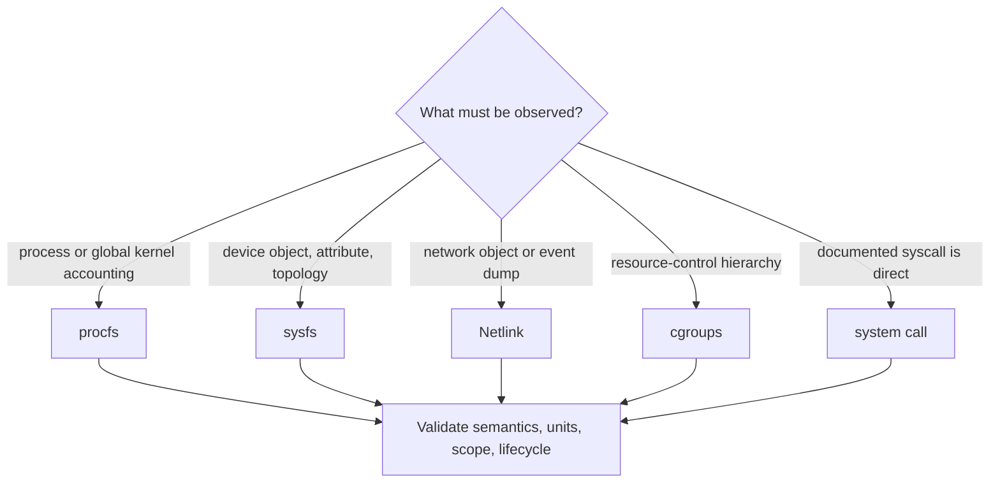
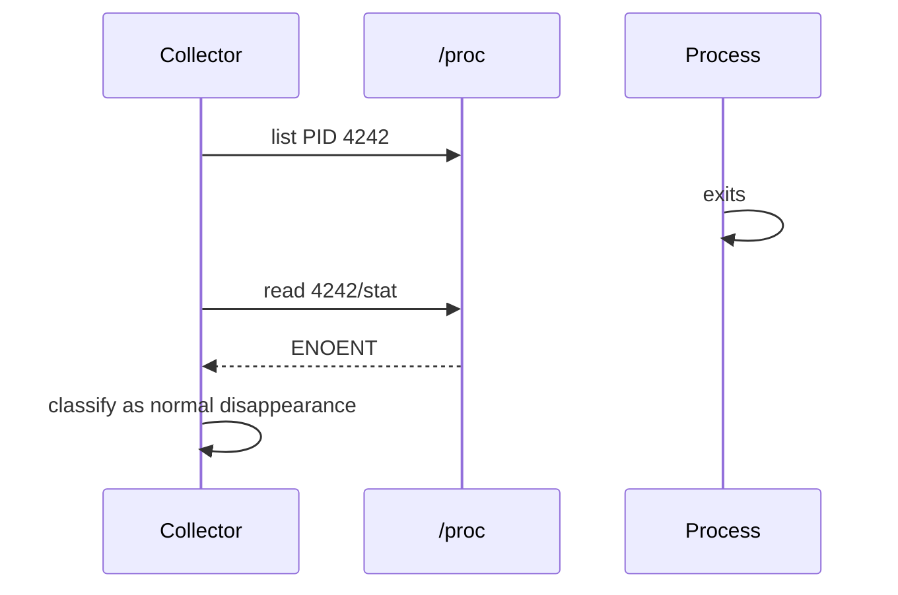
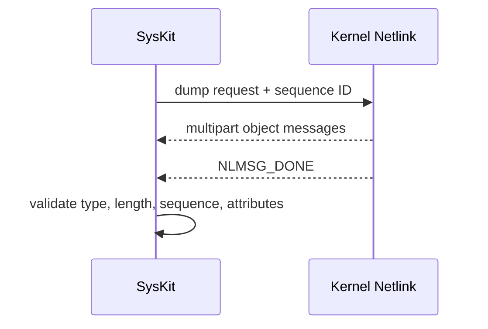
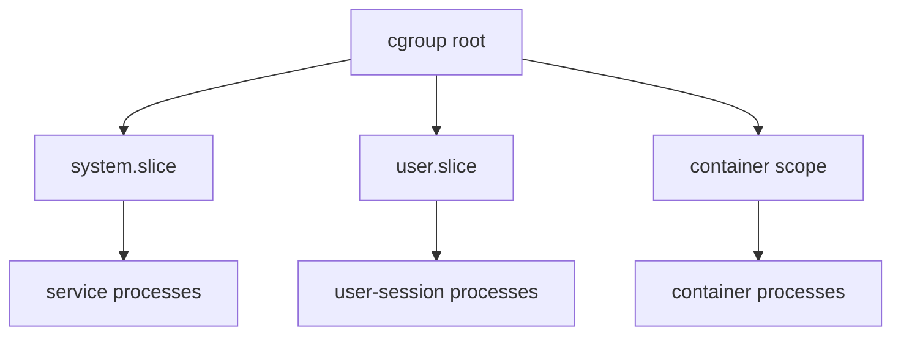

# Native Linux Kernel Interfaces

> Learn how to choose, read, validate, and test procfs, sysfs, Netlink, and
> cgroups—the primary data sources behind SysKit.

| Attribute | Value |
|---|---|
| Level | Foundation to intermediate |
| Prerequisites | [Linux foundations](linux-foundations.md), [Go for SysKit](go-systems.md) |
| Time | 3–4 hours plus labs |
| Outcome | Produce a defensible source contract for a collector |

## Learning Objectives

After this lesson, you can:

- select the native interface that best matches a domain;
- explain ABI stability, version gates, scope, permissions, and races;
- parse procfs and sysfs without assuming regular-file behavior;
- explain why Netlink is preferable for structured networking data;
- detect cgroup v1/v2 and interpret controller-relative values;
- design sanitized fixtures and live integration assertions.

## 1. Source Selection



| Interface | Best for | Shape | Main hazards |
|---|---|---|---|
| procfs | Process and global runtime accounting | Text pseudo-files/directories | races, variable fields, namespaces |
| sysfs | Device topology and one-value attributes | Hierarchical text attributes/symlinks | optional drivers, hotplug, unit quirks |
| Netlink | Network object dumps/events | Binary typed messages | multipart messages, alignment, sequence IDs |
| cgroups | Hierarchical accounting and limits | Files under mounted controller hierarchy | v1/v2 differences, delegation, `max` |
| syscalls | Direct kernel operation/query | Typed call boundary | architecture, types, permissions |

Choose the documented kernel contract that preserves semantics and minimizes
dependence on human-facing output.

## 2. ABI Contract Worksheet

Complete this before implementing a collector source:

| Question | Required answer |
|---|---|
| Primary source | Exact path, message family, or syscall |
| Authority | Kernel doc/man page and relevant feature spec |
| Record shape | Named/positional fields, delimiter, optional tail |
| Units | Raw and normalized units |
| Metric type | Counter, gauge, rate, ratio, estimate, label |
| Scope | Host, namespace, process, device, or cgroup |
| Lifecycle | Static, hotplugged, short-lived, resettable |
| Version/config gate | Minimum kernel or required option/driver |
| Permissions | Expected unprivileged behavior |
| Partial behavior | What can be unavailable independently |
| Verification | Human-only command and expected invariant |
| Fixtures | Normal, missing, malformed, restricted, edge cases |

If any cell is unknown, research comes before implementation.

## 3. procfs

procfs is normally mounted at `/proc`. It exposes per-process directories and
system-wide views.

```mermaid
flowchart TD
    PROC[/proc]
    PROC --> G[Global: stat, meminfo, loadavg, diskstats]
    PROC --> PID[PID directories]
    PROC --> NET[Namespace-relative net data]
    PROC --> PSI[Pressure: pressure/*]
    PID --> PS[stat, status, cmdline]
    PID --> FD[fd symlinks]
    PID --> CG[cgroup membership]
```

| Pattern | Example | Strategy |
|---|---|---|
| Named line | `MemTotal: 16384 kB` | split once on `:`, trim, map by key |
| Fixed prefix + columns | `cpu 1 2 3 ...` | validate prefix/min fields; tolerate documented tail |
| Blank-line records | `/proc/cpuinfo` | collect key/value blocks |
| NUL-separated bytes | `/proc/<pid>/cmdline` | split on `\x00`, not whitespace |
| Escaped fields | mount tables | decode documented octal escapes |
| Adversarial positional text | `/proc/<pid>/stat` | use format-specific boundary rule |

Enumerating `/proc` then reading PID files is never atomic:



Do not retry an exited PID indefinitely. Preserve partial collection and avoid
turning routine churn into command failure.

### procfs Lab

```bash
stat /proc/stat
wc -c /proc/stat
head -n 5 /proc/stat
cat /proc/self/status
```

Compare reported metadata size with bytes read. Identify which `status` fields
are counts, byte-derived values, identifiers, and labels.

## 4. sysfs

sysfs normally lives at `/sys` and represents kernel objects and relationships.

```mermaid
flowchart LR
    D[/sys/devices: physical hierarchy]
    C[/sys/class: class-oriented symlinks]
    B[/sys/block: block-device view]
    C -.-> D
    B -.-> D
    D --> A[one-value attributes]
```

| Path family | Teaches |
|---|---|
| `/sys/devices/system/cpu` | CPU topology, online state, frequency support |
| `/sys/class/net` | Interfaces, counters, MTU, operational state |
| `/sys/block` | Devices, partitions, queue properties, sizes |
| `/sys/devices/virtual/dmi/id` | Optional machine identity attributes |

Rules:

- treat attributes as independent and optionally absent;
- follow documented topology, not device-name regexes;
- trim trailing newlines but preserve meaningful internal whitespace;
- record exact units per attribute;
- expect hotplug between listing and reading;
- do not modify writable attributes—SysKit is read-only.

### sysfs Lab

```bash
find /sys/class/net -maxdepth 2 -type f -name operstate -print
readlink -f /sys/class/net/lo
cat /sys/block/*/size 2>/dev/null
```

Explain why `/sys/class/net/lo` is a class view rather than a second loopback
device. Convert one block-device size using the documented 512-byte unit.

## 5. Netlink

Netlink is a socket protocol between userspace and the kernel. Routing Netlink
exposes links, addresses, routes, neighbors, and related state as structured
binary messages.



| Concern | Required handling |
|---|---|
| Message header | Validate declared length before slicing |
| Alignment | Advance using Netlink alignment rules |
| Multipart dump | Continue until `NLMSG_DONE` |
| Kernel error | Decode `NLMSG_ERROR` |
| Sequence | Match responses to request |
| Attributes | Parse nested TLVs; safely ignore unknown optional types |
| Buffer growth | Handle truncation without unbounded loops |
| Namespace | Socket observes the caller's network namespace |

Tools such as `ip` and `ss` remain excellent verification utilities, but their
human-facing output is not a production collector source.

### Netlink Verification Lab

```bash
ip -details link show
ip -details address show
ip route show table all
go test ./internal/platform -run Netlink -v
```

Trace which fields originate in Netlink and which counters may come from sysfs.
A feature may combine multiple native sources.

## 6. cgroups

cgroups group processes for accounting and resource control. They are not the
same as containers: runtimes commonly create cgroups, but containers also rely
on namespaces and runtime metadata.



| Property | cgroup v1 | cgroup v2 |
|---|---|---|
| Hierarchy | Separate/per-controller possible | Unified hierarchy |
| Membership | Controller lists in `/proc/<pid>/cgroup` | `0::/path` |
| CPU usage | `cpuacct.usage` and controller files | `cpu.stat` |
| Memory usage | `memory.usage_in_bytes` | `memory.current` |
| Memory limit | `memory.limit_in_bytes` | `memory.max` (`max` allowed) |
| I/O | blkio controller files | `io.stat`, `io.max` |
| Pressure | Mostly host-level | Per-cgroup `*.pressure` |

Do not guess the active hierarchy from one familiar path. Inspect mountinfo and
membership. Limits can inherit through ancestors, so a leaf file may not fully
describe the effective ceiling.

### cgroup Lab

```bash
cat /proc/self/cgroup
findmnt -t cgroup,cgroup2
test -f /sys/fs/cgroup/cgroup.controllers && cat /sys/fs/cgroup/cgroup.controllers
```

Determine the version, membership path, and available controllers. Do not
change any controller value.

## 7. Source Correlation

```mermaid
flowchart LR
    S[Socket source] -->|socket inode| F[/proc/PID/fd symlink]
    F --> P[Process snapshot]
    P -->|cgroup path| C[cgroup files]
    P -->|UID| U[user database]
```

Correlation rules:

1. Name the join key and its scope.
2. Expect either side to disappear between reads.
3. Do not reuse stale ownership after entity replacement.
4. Preserve owner unavailable separately from no owner.
5. Put cross-domain joins in services, not independent collectors.

## 8. Fixture And Integration Design

```text
testdata/fixtures/scenario-name/
├── SOURCE
├── proc/...
└── sys/...
```

| Fixture | Purpose |
|---|---|
| Representative host | Normal parsing and meaningful values |
| Minimal/empty | Valid zero entities or header-only source |
| Missing optional | Unavailable behavior |
| Missing required | Correct failure classification |
| Malformed/truncated | Defensive parser behavior |
| Permission fake | Partial/permission path |
| Counter reset | Derived-rate safety |
| Legacy variant | Version-specific fields |

`SOURCE` should record capture date, kernel, architecture, distribution,
container/VM context, sanitization notes, and paths. Never retain secrets.

Live integration tests assert portable invariants:

| Fragile assertion | Better invariant |
|---|---|
| Host has exactly 8 CPUs | At least one online CPU exists |
| Interface is named `eth0` | At least one valid interface exists |
| Root filesystem is ext4 | A mount covering `/` exists |
| PSI averages are zero | If present, averages are in 0–100 |
| PID list includes bash | The test process can observe itself |

## Exercises

1. Complete the ABI worksheet for `/proc/loadavg`.
2. Explain the lifecycle of a network RX counter in sysfs.
3. Explain why socket views from different network namespaces cannot be joined
   blindly.
4. Design five fixtures for `memory.max`, including the literal `max`.
5. Find one SysKit integration test and state the portable invariant it asserts.

## Checkpoint

You are ready for domain lessons when you can justify a primary interface,
describe its ABI/units/scope/failures, design deterministic fixtures, and place
cross-source correlation in the correct architecture layer.

Next: [CPU](cpu.md) and [memory](memory.md).

## References

- [procfs](https://docs.kernel.org/filesystems/proc.html)
- [sysfs rules](https://docs.kernel.org/admin-guide/sysfs-rules.html)
- [Netlink introduction](https://docs.kernel.org/userspace-api/netlink/intro.html)
- [rtnetlink(7)](https://man7.org/linux/man-pages/man7/rtnetlink.7.html)
- [cgroups v2](https://docs.kernel.org/admin-guide/cgroup-v2.html)
- [SysKit collector architecture](../specs/collectors.md)
