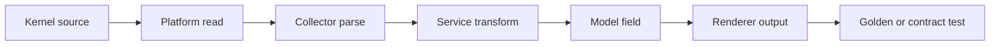
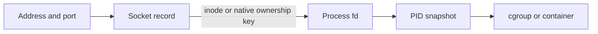

# Integrated Linux And SysKit Labs

> Reproducible investigations that combine kernel sources, SysKit output,
> architecture, and tests. Run load-producing labs only on a disposable host.

## Lab Rules

1. Start unprivileged and record kernel, SysKit, and Go versions.
2. State a hypothesis before collecting more data.
3. Record source, unit, metric type, timestamp, and observation scope.
4. Use external utilities only for verification.
5. Do not change system configuration, cgroup limits, routes, or processes.
6. Sanitize hostnames, users, addresses, PIDs, and command arguments in reports.
7. A missing capability is a valid result; explain it instead of bypassing it.

## Evidence Template

```markdown
# Lab report: <title>

## Environment
- SysKit version:
- Kernel and distribution:
- Architecture:
- Host / VM / container scope:
- Privilege level:

## Hypothesis
<A falsifiable statement>

## Sources
| Source | Metric type | Unit | Scope | Limitation |
|---|---|---|---|---|

## Procedure
1. ...

## Observations
<Sanitized raw evidence and SysKit output>

## Analysis
<Calculations, correlations, and alternative explanations>

## Conclusion
<Supported, rejected, or inconclusive—and why>

## Reproduction
<Exact safe commands and test references>
```

## Lab 1 — Trace One Value End To End

**Goal:** prove where one displayed value comes from.

Choose a field from `system`, `cpu`, or `memory`.



Tasks:

1. Run the table and JSON forms of the command.
2. Locate the raw source and document its unit.
3. Identify platform, collector, service, model, command, and renderer symbols.
4. Find the tests that pin parsing and output.
5. Explain every conversion; if none exists, say why.
6. Identify the behavior when the source is missing or malformed.

**Pass evidence:** a complete trace with no layer guessing and at least one test
that would fail if the raw value were parsed incorrectly.

## Lab 2 — Calculate CPU Utilization

**Goal:** turn cumulative CPU counters into a defensible percentage.

```bash
grep '^cpu ' /proc/stat
sleep 1
grep '^cpu ' /proc/stat
syskit cpu
```

Record timestamps around the reads. Calculate deltas and:

```text
idle_delta = idle_delta + iowait_delta
busy_delta = total_delta - idle_delta
usage_percent = 100 * busy_delta / total_delta
```

Then answer:

- Did your field-total convention double-count guest time?
- Was the real interval exactly one second?
- Could hotplug or counter reset invalidate the comparison?
- Why can your manual value differ slightly from SysKit's independently timed sample?

**Pass evidence:** arithmetic, timestamps, counter classification, and a
defensible tolerance—not merely similar percentages.

## Lab 3 — Capacity Is Not Pressure

**Goal:** distinguish memory capacity, reclaimability, swapping, and stalls.

```bash
syskit memory
cat /proc/meminfo
cat /proc/pressure/memory 2>/dev/null
free -w
vmstat 1 5
```

Create this table:

| Signal | Observation | What it supports | What it cannot prove |
|---|---:|---|---|
| `MemFree` |  | wholly unused pages | allocation headroom |
| `MemAvailable` |  | estimated allocatable memory | active stalls |
| Swap used |  | cold pages live in swap | current thrashing |
| PSI some/full |  | task stall time | root cause alone |
| swap-in/out rate |  | active swap traffic | all memory pressure |

If PSI is missing, classify it as unavailable and explain which weaker evidence
remains. Do not create artificial memory pressure on a shared machine.

**Pass evidence:** a conclusion that uses more than free percentage and states
what would change the diagnosis.

## Lab 4 — Map Storage Layers

**Goal:** map a path to mount, filesystem, block device, and I/O counters.

```bash
syskit filesystem
syskit disk
findmnt -T /
cat /proc/self/mountinfo
cat /proc/diskstats
```

```mermaid
flowchart LR
    Path[/selected path] --> Mount[Mount point]
    Mount --> FS[Filesystem type and statfs]
    FS --> Dev[major:minor or source]
    Dev --> Sys[/sys/dev/block topology]
    Dev --> IO[/proc/diskstats counters]
```

Handle virtual/overlay/device-mapper filesystems honestly; the chain may not end
at one physical disk. Record byte capacity and inode capacity separately.

**Pass evidence:** joined sources with explicit keys and a statement of where
the mapping is one-to-many, virtual, or namespace-relative.

## Lab 5 — Observe Process Races And Permissions

**Goal:** explain why process collection is necessarily partial.

1. Run `syskit process` as your normal user.
2. Inspect `/proc/self/stat`, `status`, `cmdline`, and `fd`.
3. Attempt to inspect a permitted and an unpermitted PID without elevation.
4. Start a short-lived process in a loop while repeatedly listing processes.
5. Find tests for hostile `comm`, NUL-separated command lines, or disappearance.

| Event | Expected collector behavior |
|---|---|
| PID vanishes after directory listing | Skip normally; do not fail all data |
| `fd` access denied | Owner detail unavailable/partial |
| `cmdline` empty | Kernel thread/zombie fallback to `comm` |
| `comm` contains spaces/parentheses | Safe format-specific parsing |
| UID cannot be resolved | Preserve numeric identity or unavailable name |

**Pass evidence:** a lifecycle diagram and test-backed explanation of at least
three partial-data paths.

## Lab 6 — Socket To Process Correlation

**Goal:** trace a listening socket to an owning process.

```bash
syskit ports
syskit network
ss -lntup
ip address show
ip route show
```

External tools above verify the result. For the native path, document:



Explain how permissions, process exit, network namespaces, wildcard addresses,
IPv6, and socket reuse can make ownership partial or time-sensitive.

**Pass evidence:** one complete mapping and one honest unavailable/ambiguous
case, each with observation scope.

## Lab 7 — Container Scope

**Goal:** distinguish host, namespace, and cgroup values.

```bash
syskit containers
cat /proc/self/cgroup
cat /proc/self/mountinfo
cat /sys/fs/cgroup/memory.current 2>/dev/null
cat /sys/fs/cgroup/memory.max 2>/dev/null
```

Compare `/proc/meminfo` with cgroup memory when available. Answer:

- Is the system using cgroup v1, v2, or a hybrid layout?
- Is the memory limit numeric or `max`?
- Which values describe the host, current namespace, and current cgroup?
- What runtime/container identity is heuristic rather than kernel-guaranteed?

**Pass evidence:** a scope table and no claim that cgroup membership alone proves
a specific container runtime.

## Lab 8 — Review A Parser Like An Adversary

**Goal:** design tests before changing implementation.

Choose a parser and build a matrix:

| Case | Input mutation | Expected value/error | Risk prevented |
|---|---|---|---|
| valid | representative fixture | typed result | baseline |
| whitespace | tabs/extra newline | documented tolerance | brittle splitting |
| truncated | remove required tail | parse error | index panic/wrong zero |
| extra | append future field | accepted if ABI allows | kernel-version break |
| overflow | max+1 numeric | error | wrapped arithmetic |
| missing optional | remove source | unavailable | fabricated zero |
| permission | injected error | partial/classified | all-or-nothing failure |

Add no code unless the feature spec permits the behavior. If you do implement a
test improvement, run the narrow test, race suite, vet, and relevant integration
test.

**Pass evidence:** every case cites the source contract rather than personal
preference.

## Lab 9 — Live View State Machine

**Goal:** test behavior that is independent from visual styling.

Inspect `dashboard`, `top`, `watch`, or the interactive menu. Draw states and
events for load, refresh, resize, navigation, error, and quit. Then locate tests
for:

- narrow and zero terminal sizes;
- resize while data is loading;
- cancellation and ticker cleanup;
- service error and recovery;
- no-color semantics;
- stdout behavior outside a TTY.

**Pass evidence:** an event/state table and a statement showing that the TUI
delegates to the same services as explicit commands.

## Capstone — Evidence-Backed Incident Report

Choose one scenario:

- high load with low CPU use;
- low free memory without memory pressure;
- full inodes with free bytes;
- I/O activity with unclear physical-device mapping;
- listening port with unavailable owner;
- container reporting host-relative memory.

Produce a sanitized report using the template. Use at least three independent
signals, identify primary versus verification sources, trace one value through
SysKit, and propose one fixture/test that protects the learned edge case.

## Assessment Rubric

| Dimension | Needs work | Competent | Strong |
|---|---|---|---|
| Linux semantics | Names values only | Correct type/unit/scope | Explains ABI and lifecycle tradeoffs |
| Evidence | Screenshots/claims | Reproducible sources | Cross-validates and records limitations |
| Reasoning | Jumps to conclusion | Tests a hypothesis | Evaluates alternatives/disconfirming data |
| SysKit architecture | Treats CLI as monolith | Correct layer trace | Identifies ownership and contract risks |
| Reliability | Happy path only | Missing/error cases | Races, resets, permissions, versions |
| Testing | Says tests are needed | Concrete test matrix | Fixtures, invariants, golden and benchmark fit |
| Communication | Ambiguous narrative | Clear reproducible report | Concise decisions and useful diagrams |

A capstone passes when every dimension is at least **Competent**. Complete
[checklists.md](checklists.md) with links to the evidence you produced.
