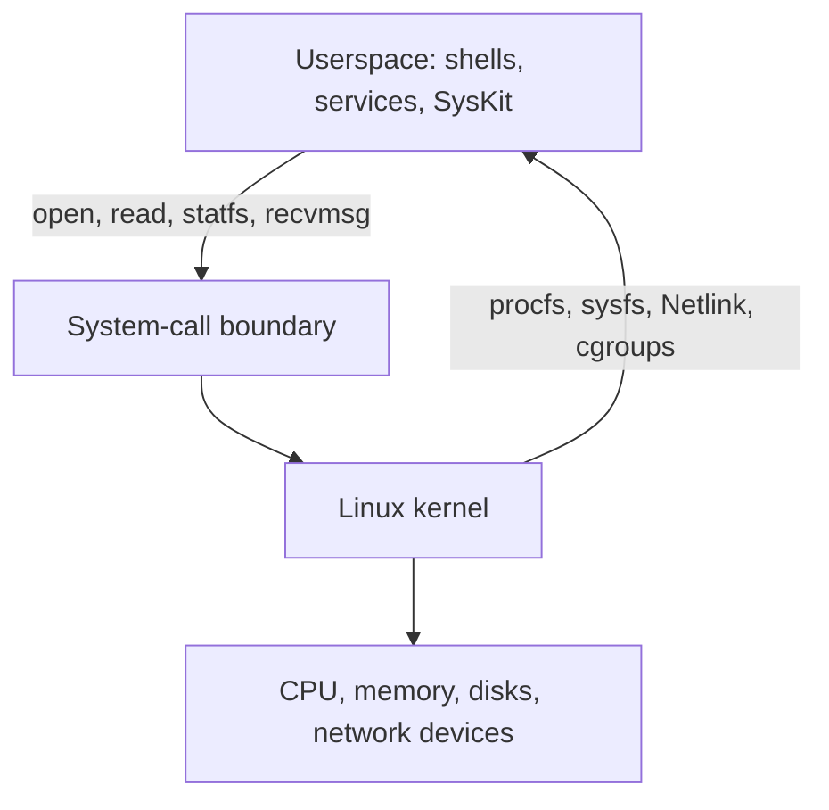
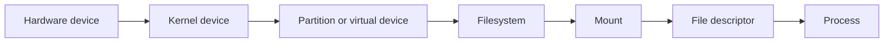
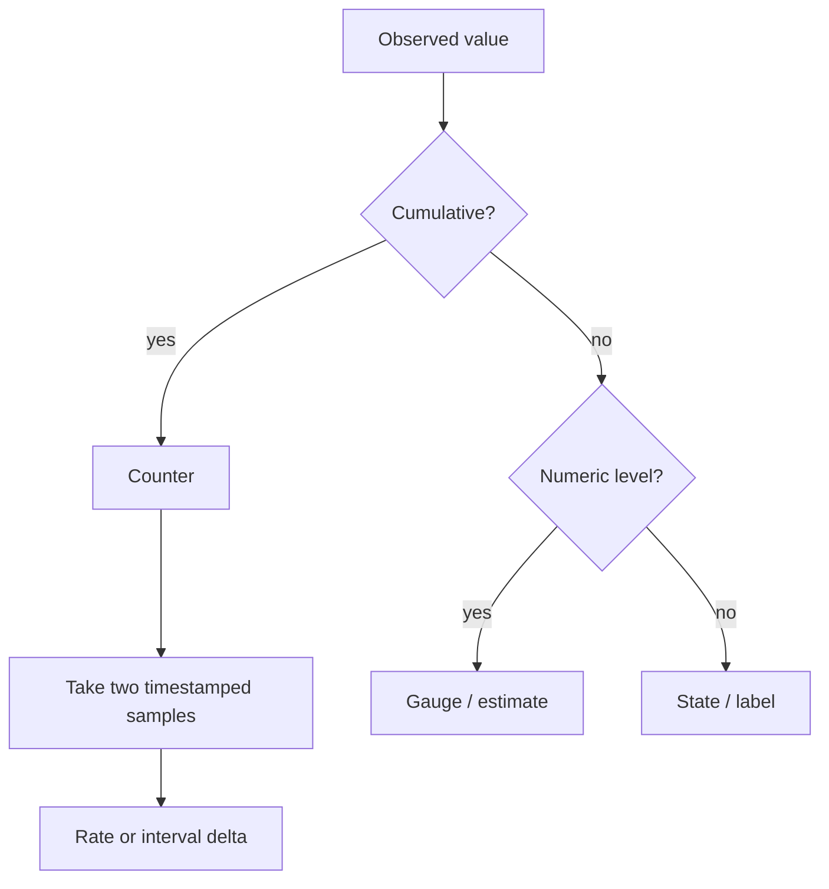
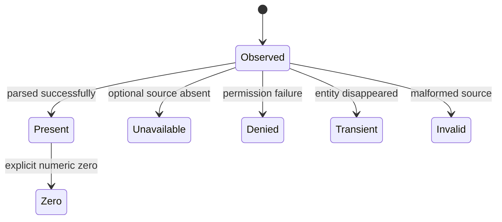

# Linux Foundations For System Inspection

> Build the mental model needed to interpret Linux telemetry before learning
> individual SysKit domains.

| Attribute | Value |
|---|---|
| Level | Foundation |
| Prerequisites | Basic shell navigation |
| Time | 2–3 hours plus exercises |
| Outcome | Explain Linux resources, units, observations, and failure modes |

## Learning Objectives

After this lesson, you can:

- distinguish the kernel, userspace, a process, a thread, and a system call;
- explain virtual filesystems, devices, mounts, namespaces, and cgroups;
- classify a metric as a counter, gauge, rate, ratio, estimate, or label;
- normalize sectors, pages, ticks, milliseconds, and kibibytes safely;
- distinguish absent, permission-denied, malformed, transient, and zero values;
- investigate without confusing a verification tool with a collector source.

## 1. The System Model

Linux is a kernel. A distribution combines that kernel with userspace programs,
libraries, configuration, and a package manager. SysKit runs in userspace and
observes kernel state through documented interfaces.



| Concept | Meaning | SysKit relevance |
|---|---|---|
| Kernel | Privileged core managing hardware and resources | Produces the authoritative data |
| Userspace | Unprivileged programs outside the kernel | SysKit lives here |
| System call | Controlled request from userspace to kernel | File reads and Netlink operations use them |
| Process | Resource container with an address space and credentials | Listed from `/proc/<pid>` |
| Thread | Schedulable execution unit within a process | Appears under `/proc/<pid>/task` |
| File descriptor | Per-process handle to a file/socket/device | Correlates sockets to owners |
| Namespace | Scoped view of resources | Explains why containers see different PIDs/networks |
| cgroup | Hierarchical resource accounting/control group | Supplies container-relative usage and limits |

### Lab 1 — Trace A Read

```bash
strace -e trace=openat,read,close cat /proc/uptime
```

Identify the `openat`, `read`, and `close` calls. `cat` is a **verification-only
tool** here. SysKit calls the same kernel file operations through Go rather than
executing `cat`.

## 2. Everything Is Not A Regular File

Linux exposes many objects through pathnames, but pathname syntax does not make
them ordinary disk-backed files.

| Kind | Example | Backed by | Important behavior |
|---|---|---|---|
| Regular file | `/etc/os-release` | Filesystem storage | Seekable and persistent |
| procfs entry | `/proc/stat` | Kernel-generated view | Dynamic; size may be reported as zero |
| sysfs attribute | `/sys/class/net/eth0/mtu` | Kernel object model | Usually one value per file |
| Device node | `/dev/nvme0n1` | Device driver | Reads address hardware blocks |
| Socket | `/run/example.sock` | Kernel IPC endpoint | Stream/message semantics |
| Symlink | `/proc/self/fd/1` | Reference to another path/object | Target may change or disappear |

Consequences for parsers:

- do not trust a pseudo-file's metadata size to allocate the read buffer;
- do not assume values remain stable across two reads;
- do not assume directory entries survive until they are opened;
- do not write unless the product explicitly owns a mutation feature—SysKit core
  is read-only;
- use the injected platform seam so the same parser can consume fixtures.

## 3. Resource Layers

Many diagnostic mistakes come from collapsing adjacent layers:



The same discipline applies to networking: device → interface → address → route
→ socket → file descriptor → process. A single output row may join multiple
sources, but those sources do not become one concept.

## 4. Metric Types

Correct arithmetic begins by classifying the value.

| Type | Definition | Example | Valid operation |
|---|---|---|---|
| Counter | Cumulative value that normally increases | bytes received | Difference two samples |
| Gauge | Current level that can rise or fall | memory available | Read directly |
| Rate | Counter change per elapsed time | bytes/second | `delta / duration` |
| Ratio | One comparable quantity divided by another | filesystem used percent | `used / total` |
| Estimate | Kernel-derived approximation | `MemAvailable` | Preserve semantics and source |
| State/label | Categorical value | TCP `LISTEN`, process `D` | Map without numeric arithmetic |



### Counter Safety Checklist

Before subtracting two counters, ask:

1. Do both observations describe the same entity?
2. Did the entity reset, reboot, disappear, or get replaced?
3. Can the counter wrap at its declared width?
4. Is elapsed time positive and measured with a monotonic clock?
5. Did CPU hotplug or interface recreation change the set?
6. Is the unit per-operation, sectors, bytes, ticks, or time?

If a later counter is smaller and reset/wrap cannot be resolved reliably, mark
the derived rate unavailable for that interval. Unsigned underflow is not data.

## 5. Units And Conversions

Linux interfaces are consistent within a specific ABI, not across all ABIs.

| Source value | Kernel unit | Conversion to base unit |
|---|---|---|
| `/proc/meminfo` value ending `kB` | KiB despite spelling | `bytes = value × 1024` |
| `/sys/block/<dev>/size` | 512-byte sectors | `bytes = value × 512` |
| `/proc/<pid>/stat` RSS | pages | `bytes = pages × page_size` |
| `/proc/stat` CPU time | user clock ticks | retain ticks for ratios; use `CLK_TCK` for seconds |
| cpufreq sysfs | kHz | `Hz = value × 1000` |
| PSI `total` | microseconds | `duration = value × µs` |
| diskstats times | milliseconds | `duration = value × ms` |

Use integer base units in models where possible. Format human-readable units at
the presentation boundary. Before multiplying `uint64` values, check overflow:

```go
if value > math.MaxUint64/unit {
    return 0, fmt.Errorf("convert value to bytes: overflow")
}
bytes := value * unit
```

Do not use floating point merely to convert exact byte counts. Use it when the
domain is actually fractional, such as a percentage or average.

## 6. Observation Is Partial

A robust inspector reports what it knows without turning uncertainty into a
plausible-looking number.

| Situation | Meaning | Correct treatment |
|---|---|---|
| Value is `0` | Source explicitly reports zero | Preserve zero |
| Optional file absent | Kernel/driver does not expose capability | Unavailable/unsupported |
| Required file absent | Expected source cannot be accessed | Error with source context |
| `EACCES` / `EPERM` | Credentials cannot observe it | Permission or partial result |
| PID path vanishes | Process exited during collection | Skip/partial, normally not fatal |
| Text is malformed | ABI input cannot be parsed | Parse error; never coerce to zero |
| Counter decreases | Reset, wrap, replacement, or bad sample | Rate unavailable unless resolved |



“Unavailable” is metadata about observation. “Zero” is a measured value. They
must not share the same representation if users can draw different conclusions.

## 7. Namespaces And Scope

A reading is meaningful only with its observation scope.

| Namespace | Isolates | Common surprise |
|---|---|---|
| PID | Process identifiers | PID 1 inside a container is not host PID 1 |
| Network | Interfaces, routes, sockets | Host and container see different listening ports |
| Mount | Mount table | `/proc/self/mountinfo` is observer-relative |
| User | UID/GID mapping | Container root may map to an unprivileged host UID |
| UTS | Hostname/domain name | Container hostname can differ from host |

`/proc/self/...` intentionally means “the view of the current process.” SysKit
must document whether a result is host-relative, namespace-relative, or
cgroup-relative rather than calling every number “system-wide.”

## 8. Permissions And Safe Investigation

Start unprivileged. Elevation can hide the exact partial-data behavior that
normal users need the tool to handle.

| Action | Risk | Safer habit |
|---|---|---|
| Reading `/proc/<pid>/environ` | Secrets in environment variables | Avoid capture; redact completely |
| Capturing command lines | Tokens and customer data | Replace sensitive arguments |
| Reading other namespaces | Misinterpreting scope | Record namespace identity |
| Running load generators | Resource exhaustion | Use a disposable VM and limits |
| Dropping caches/changing sysctls | System-wide behavior change | Do not use on shared systems |

SysKit's core is observational. Exercises should not send signals, alter network
configuration, write cgroup limits, or modify kernel parameters.

## 9. Investigation Method

For any surprising value, write down:

| Question | Example answer |
|---|---|
| What claim am I testing? | “Disk writes are causing latency.” |
| What is the primary source? | `/proc/diskstats` plus PSI I/O |
| Is it a counter or gauge? | Counter; needs two samples |
| What are the units? | sectors and milliseconds |
| What is the observation scope? | Current mount/PID namespace |
| What could make it unavailable? | Device removal or permission |
| What verifies it independently? | `iostat` as verification only |
| What evidence would disprove it? | Low I/O deltas and no I/O stalls |

Avoid diagnosing from a single metric. Capacity, activity, latency, and pressure
answer different questions even when they concern the same resource.

## Exercises

1. Classify these values: `/proc/loadavg` 1-minute load, network RX bytes,
   current CPU frequency, process state, filesystem used percent, PSI avg10.
2. Convert `1,953,525,168` disk sectors to bytes without floating point.
3. Explain why a missing cpufreq file is not equivalent to `0 Hz`.
4. Read `/proc/self/mountinfo` from host and container contexts if available;
   explain differences without declaring one view incorrect.
5. Find an explicitly zero field and an unavailable field on your host. Record
   the source, scope, and why their meanings differ.

### Exercise Guidance

1. Load average is an estimate/gauge-like average; RX bytes is a counter;
   frequency is a gauge; state is a label; used percent is a ratio; PSI avg10 is
   a kernel-computed rolling percentage.
2. Multiply by 512: `1,000,204,886,016` bytes.
3. Missing means the driver/kernel does not expose the observation. Zero would
   claim an exposed CPU clock is stopped.

## Checkpoint

You are ready to continue when you can explain, without notes:

- why two snapshots are necessary for counter rates;
- why base units belong in models and display units in renderers;
- why namespace and permission context are part of a measurement;
- why native kernel sources and verification utilities serve different roles;
- how zero, unavailable, transient, denied, and malformed differ.

Next: [Go for SysKit](go-systems.md).

## References

- [Linux man-pages project](https://man7.org/linux/man-pages/)
- [Linux kernel documentation](https://docs.kernel.org/)
- [procfs documentation](https://docs.kernel.org/filesystems/proc.html)
- [sysfs rules](https://docs.kernel.org/admin-guide/sysfs-rules.html)
- [namespaces overview](https://man7.org/linux/man-pages/man7/namespaces.7.html)
- [cgroups v2](https://docs.kernel.org/admin-guide/cgroup-v2.html)
