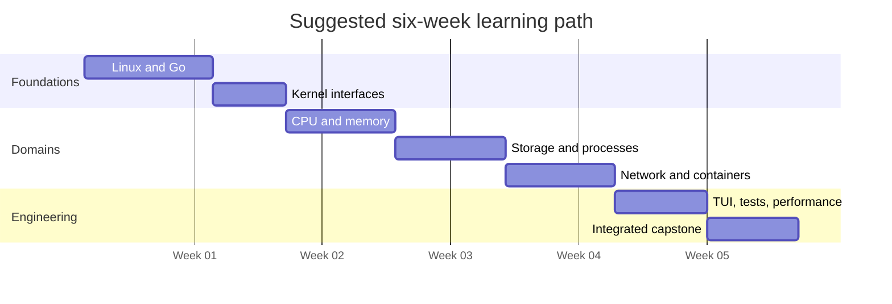
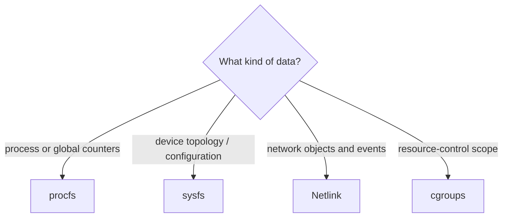

# Learning Roadmap

> A staged route from Linux fundamentals to independently engineering a SysKit
> feature. Start at the first stage whose exit criteria you cannot yet prove.

Read the [Learning Center](README.md) first for course conventions, safe lab
setup, and the competency model.

## Roadmap At A Glance



The dates are placeholders used only to show sequencing. Compress or expand the
path according to prior experience.

| Phase | Focus | Deliverable | Exit gate |
|---:|---|---|---|
| 0 | Orientation | Local toolchain and baseline | Build and tests pass |
| 1 | Linux + Go foundations | Vocabulary and small parser | Explain units and error flow |
| 2 | Native kernel interfaces | Source-selection worksheet | Defend procfs/sysfs/Netlink/cgroup choice |
| 3 | Host resources | CPU/memory investigation | Derive a rate and interpret PSI |
| 4 | Storage + processes | Cross-source correlation | Handle mounts and PID races |
| 5 | Network + containers | Ownership and scope map | Trace socket and cgroup membership |
| 6 | Live UI + engineering | Tested vertical slice | All relevant quality gates pass |
| 7 | Capstone | Incident report or feature study | Evidence reviewed against rubric |

## Phase 0 — Orientation

Read:

1. [Project README](../README.md)
2. [Engineering constitution](../specs/constitution.md)
3. [Canonical architecture](../ARCHITECTURE.md)
4. [Learning Center](README.md)

Run:

```bash
go version
go build ./...
go test ./...
go run ./cmd/syskit --help
```

**Exit criteria:** you can locate the CLI, service, collector, platform, model,
renderer, fixtures, feature specification, and tests for one command.

## Phase 1 — Linux And Go Foundations

Read [Linux foundations](linux-foundations.md), then [Go for SysKit](go-systems.md).

Focus on:

- processes, filesystems, devices, namespaces, permissions, and signals;
- bytes vs. sectors vs. pages vs. ticks;
- counters, gauges, rates, ratios, estimates, and missing values;
- Go parsing, interfaces, errors, contexts, tests, and package boundaries.

**Practice:** choose one small procfs file, save a sanitized fixture, parse one
field, and write table-driven tests for valid, missing, and malformed input.

**Exit criteria:** explain why `0`, unavailable, malformed, and permission denied
are four different states and show how the code preserves that distinction.

## Phase 2 — Kernel Interfaces

Read [Kernel interfaces](kernel-interfaces.md).



**Practice:** for CPU frequency, interface addresses, and container memory,
identify the primary source, its unit, optionality, permission behavior, and a
verification-only command.

**Exit criteria:** produce a source table that a collector implementer could use
without guessing or parsing external command output.

## Phase 3 — Host Identity And Resources

Read [system and diagnostics](system-diagnostics.md), [CPU](cpu.md), and
[memory](memory.md).

Focus on:

- logical CPUs, topology, jiffies, load average, and two-snapshot utilization;
- kernel/distribution identity, uptime clocks, and explainable diagnostic rules;
- `MemAvailable`, cache, swap, PSI, and container-relative memory;
- overflow-safe subtraction, real elapsed time, hotplug, and unavailable fields.

**Practice:** trace a system identity/load field, manually calculate aggregate
CPU utilization from two `/proc/stat` samples, then explain whether low
`MemFree` is a problem using `MemAvailable` and PSI as evidence.

**Exit criteria:** your result agrees with SysKit within a defensible sampling
tolerance, your memory conclusion distinguishes capacity from pressure, and one
diagnostic finding is explained with evidence and limitations.

## Phase 4 — Storage And Processes

Read [disk](disk.md), [filesystem](filesystem.md), and [processes](process.md).

Focus on:

- devices → partitions → filesystems → mounts;
- sectors, blocks, byte capacity, inodes, and cumulative I/O counters;
- PID/TID, process states, stat parsing, permissions, and disappearing PIDs.

**Practice:** trace one mounted filesystem back to its device and trace one
process from `/proc/<pid>/stat` through its file descriptors.

**Exit criteria:** explain why full bytes, full inodes, and high I/O latency are
different failures; parse an adversarial process name correctly.

## Phase 5 — Network And Containers

Read [network](network.md) and [containers and plugins](containers.md).

Focus on:

- interfaces, addresses, routes, sockets, ports, TCP states, and network namespaces;
- socket inode-to-PID correlation and its races/permission limits;
- cgroup v1/v2 discovery, membership, controllers, limits, and `max`;
- plugin process isolation, protocol versioning, and trust boundaries.

**Practice:** locate a listening socket, correlate it to a process, and identify
that process's cgroup without using the verification utility as a data source.

**Exit criteria:** draw the complete correlation chain and label every place
where data may disappear, be unavailable, or belong to another namespace.

## Phase 6 — Live Views And Engineering

Read [dashboard and watch](dashboard.md) and [engineering SysKit](engineering.md).

Focus on:

- monotonic time, refresh cadence, jitter, cancellation, resize, and backpressure;
- architecture boundaries and deterministic rendering;
- fixtures, unit/integration/golden tests, fuzzing, race tests, and benchmarks;
- error classification, stdout/stderr separation, and compatibility contracts.

**Practice:** follow one existing feature from source bytes to a golden file.
Change only a fixture value and predict every affected test before running it.

**Exit criteria:** complete the feature review worksheet in `engineering.md` and
run the relevant Definition of Done checks successfully.

## Phase 7 — Integrated Labs

Complete at least two [integrated labs](labs.md):

- one incident investigation;
- one implementation or test-design lab.

Recommended capstone: create a sanitized fixture scenario representing a real
operational symptom, document the source semantics, add or improve a parser
test, and explain the result in table and structured-output terms.

**Exit criteria:** score at least “competent” on every capstone rubric dimension
and leave reproducible evidence another contributor can follow.

## The Feature Study Loop

Use this loop for every new feature after the course:

1. Read the feature spec and acceptance criteria.
2. Read its domain lesson and authoritative kernel references.
3. Inventory sources, units, version gates, permissions, and races.
4. Capture sanitized fixtures with provenance.
5. Define model semantics, especially unavailable and partial data.
6. Write parser tests before or with implementation.
7. Implement the smallest vertical slice through every architecture layer.
8. Add service, command, renderer, golden, and integration coverage as needed.
9. Benchmark hot paths and inspect allocations.
10. Update specs, user docs, learning notes, and changelog where applicable.

Track progress with [learning checklists](checklists.md). Completion is evidence,
not a checked box without a reproducible artifact.
