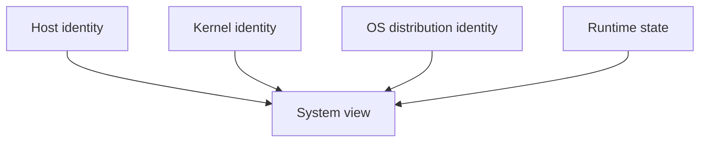
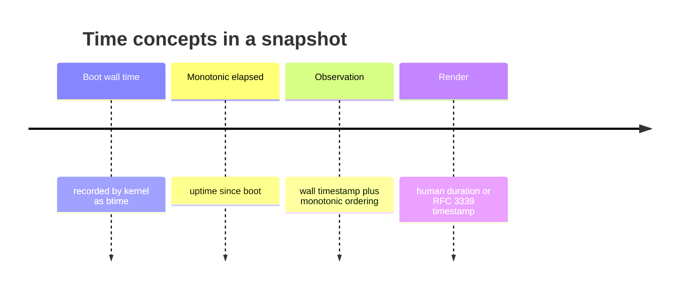
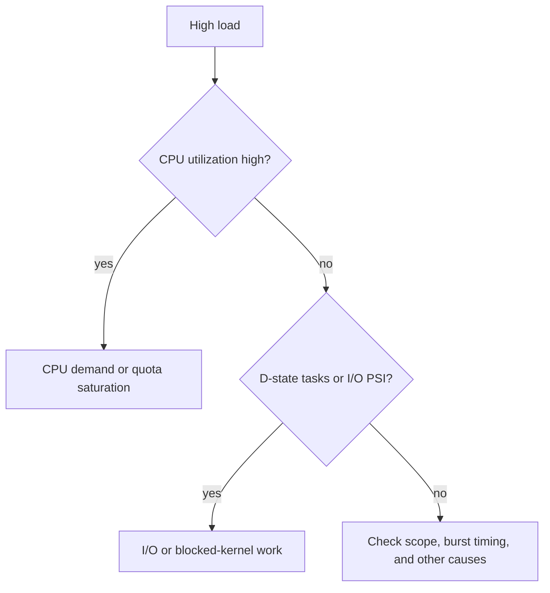
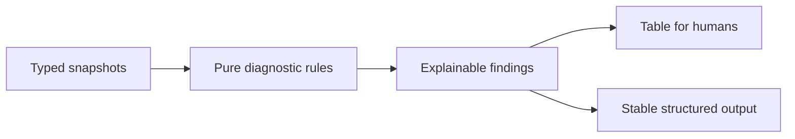

# System Identity, Uptime, Load, And Diagnostics

> Learn how SysKit describes a Linux host and turns multiple observations into
> explainable, read-only diagnostic findings.

| Attribute | Value |
|---|---|
| Level | Domain integration |
| Prerequisites | [Linux foundations](linux-foundations.md), [kernel interfaces](kernel-interfaces.md) |
| Time | 2–3 hours |
| Product contracts | [System](../specs/features/system.md), [diagnostics](../specs/features/diagnostics.md) |

## Learning Objectives

After this lesson, you can:

- distinguish kernel, distribution, machine, and runtime identity;
- parse uptime and load averages with correct semantics;
- interpret boot-relative values without confusing clocks;
- combine capacity, activity, latency, and pressure into a cautious diagnosis;
- design explainable findings with evidence, severity, and limitations;
- test diagnostics deterministically without depending on a busy live host.

## 1. What Is “The System”?



| Question | Typical source | Important limitation |
|---|---|---|
| What hostname is visible? | `/proc/sys/kernel/hostname` | UTS-namespace relative |
| Which kernel is running? | `/proc/sys/kernel/osrelease`, version | Not the distribution version |
| Which distribution identifies itself? | `/etc/os-release` | File can be absent/minimal in images |
| How long since boot? | `/proc/uptime` | First value is elapsed seconds, sampled now |
| How loaded is scheduling/I/O wait? | `/proc/loadavg` | Not CPU percent |
| When did boot occur? | `btime` in `/proc/stat` | Wall-clock timestamp with clock-change caveats |

Kernel release and distribution release are independent. A container may show
its image's `/etc/os-release` while sharing the host kernel. Report both without
inventing a single combined “Linux version.”

## 2. `/etc/os-release`

This file uses newline-separated shell-like assignments, but a collector should
parse the documented format rather than execute/source it.

```text
NAME="Example Linux"
ID=example
VERSION_ID="1.0"
PRETTY_NAME="Example Linux 1.0"
```

| Rule | Reason |
|---|---|
| Split on the first `=` | Values may contain `=` |
| Support quoted and unquoted values | Both are valid |
| Decode documented escapes | Quotes/backslashes are syntax, not display text |
| Ignore unknown keys | New distribution fields are additive |
| Prefer `PRETTY_NAME` for display | It is intended for presentation |
| Preserve stable IDs separately | Automation should not parse pretty text |

Missing optional distribution identity must not prevent kernel/uptime data from
being returned.

## 3. Uptime And Clocks

`/proc/uptime` contains two floating-point seconds values: system uptime and
aggregate idle time. For user display, duration rounding belongs in rendering;
the model retains precise duration semantics.



Use monotonic elapsed time for rate intervals so a wall-clock adjustment does
not create a negative or inflated rate. Use wall time when the public contract
requires a calendar timestamp.

## 4. Load Average

`/proc/loadavg` contains 1, 5, and 15 minute exponentially damped load averages,
a runnable/total task count, and the latest PID.

```text
0.42 0.58 0.61 2/913 42424
```

Load counts tasks runnable on CPU and tasks in uninterruptible sleep. Therefore:

- load 8 on an 8-logical-CPU host may indicate saturation;
- load 8 with low CPU usage may point to many `D`-state I/O waits;
- load must be normalized against available CPUs for context, but remains not a
  percentage;
- cgroup CPU quota can make host CPU count a misleading denominator.



This is an investigation tree, not an automatic proof.

## 5. From Metrics To Diagnostics

A diagnostic finding is a transparent inference over observations. It must
state evidence and avoid pretending a threshold proves root cause.

| Component | Example |
|---|---|
| Finding ID | stable machine-readable identifier |
| Severity | info, warning, critical according to contract |
| Summary | concise user-facing symptom |
| Evidence | exact metrics, values, units, and scopes |
| Reasoning | why those observations triggered the finding |
| Limitations | unavailable sources or alternative explanations |
| Suggested next read | safe observation, never an unapproved mutation |



Diagnostic rules belong in the service layer. Collectors return facts; they do
not decide whether a fact is “healthy.” Renderers present findings; they do not
re-evaluate thresholds.

## 6. Four Diagnostic Dimensions

| Dimension | Question | Example signals |
|---|---|---|
| Capacity | How close to a finite limit? | available bytes, filesystem/inode percent, cgroup max |
| Activity | How much work occurs per time? | CPU%, IOPS, network bytes/s, swap rate |
| Latency | How long does work wait? | disk time, request latency where available |
| Pressure | Are tasks stalled for the resource? | CPU/memory/I/O PSI |

A full disk is capacity. A busy disk is activity. A slow request is latency. I/O
PSI is pressure. They can correlate but are not interchangeable.

## 7. Severity And Thresholds

Thresholds need context:

- a short spike and sustained condition have different impact;
- a ratio without an absolute denominator can mislead;
- missing evidence lowers confidence and must not become an all-clear;
- host thresholds may not apply to a constrained cgroup;
- threshold changes alter user-visible behavior and require spec/test/doc review.

Prefer pure rules over hidden state. If a rule requires duration or hysteresis,
state the sampling/history requirement explicitly; SysKit has no persistent
historical store.

## 8. Deterministic Tests

| Test scenario | Expected lesson |
|---|---|
| healthy representative snapshot | no false warning |
| exactly below/at/above threshold | explicit boundary semantics |
| high load + high CPU | evidence points to runnable demand |
| high load + low CPU + I/O pressure | finding describes blocked work possibility |
| low free + high available + zero PSI | no false memory-pressure diagnosis |
| missing PSI | finding confidence/field is partial, not zero |
| full inodes + free bytes | filesystem finding cites inode capacity |
| multiple collector errors | unaffected findings remain; partial status is visible |

Build these from synthetic typed snapshots. Live integration tests assert source
invariants, not that CI happens to be unhealthy.

## Practical Lab

1. Run `syskit system` in table and JSON form.
2. Trace hostname, kernel, OS release, uptime, and load to their sources.
3. Run `syskit diagnostics` and list every source behind each finding.
4. For one finding, write an alternative explanation and the extra evidence
   needed to distinguish it.
5. Locate the service test that controls its threshold/boundary behavior.

## Failure-Mode Matrix

| Case | Correct behavior |
|---|---|
| `/etc/os-release` missing | Preserve kernel/system facts; OS identity unavailable |
| malformed uptime | Contextual parse failure, no fabricated boot time |
| high load on many CPUs | Add CPU-count context; never call load a percentage |
| diagnostic source unavailable | Mark finding/evidence partial; no false healthy state |
| two rules share evidence | Consistent typed source, independently explainable findings |
| wall clock changes | Rate intervals remain monotonic |

## Checkpoint

Trace every system field to its scope and source, then explain one diagnostic as
a falsifiable inference with evidence, limitations, alternative explanations,
and deterministic test coverage.

## References

- [os-release(5)](https://man7.org/linux/man-pages/man5/os-release.5.html)
- [proc_uptime(5)](https://man7.org/linux/man-pages/man5/proc_uptime.5.html)
- [proc_loadavg(5)](https://man7.org/linux/man-pages/man5/proc_loadavg.5.html)
- [proc_stat(5)](https://man7.org/linux/man-pages/man5/proc_stat.5.html)
- [PSI](https://docs.kernel.org/accounting/psi.html)
- [SysKit diagnostic feature](../specs/features/diagnostics.md)
